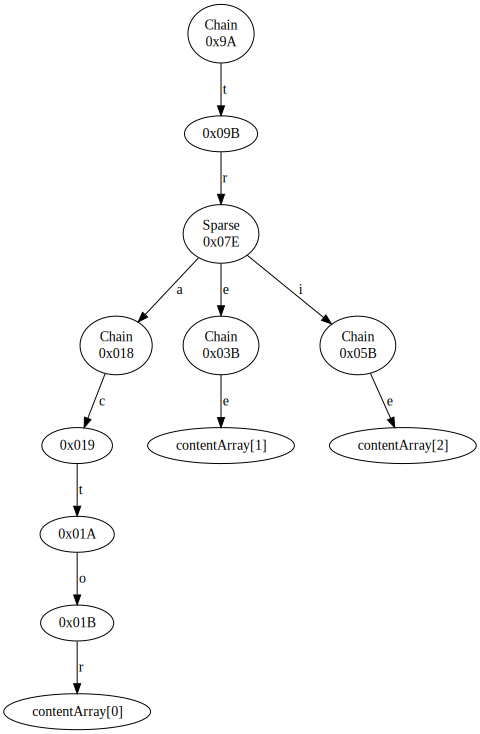
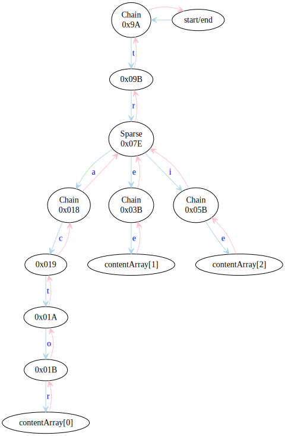
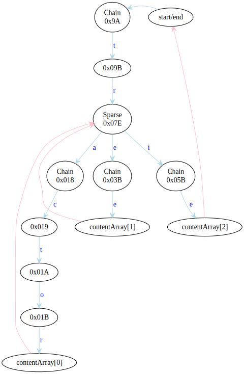
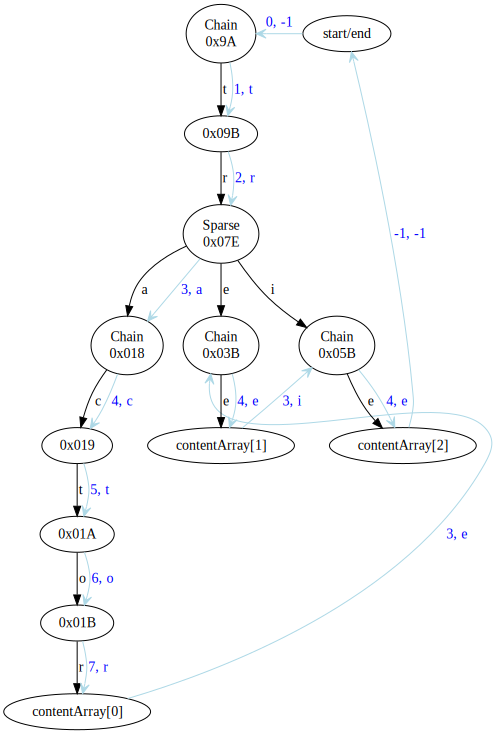
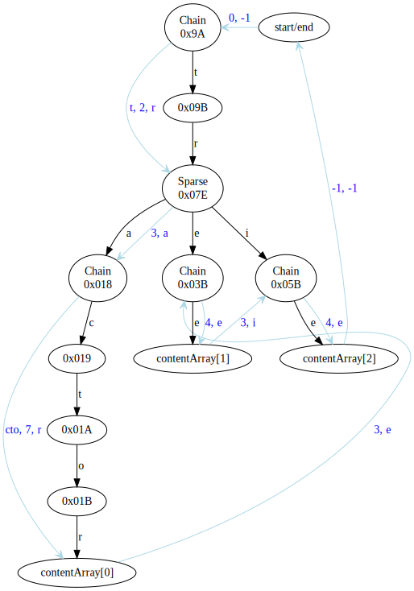

<!---
 Licensed to the Apache Software Foundation (ASF) under one
 or more contributor license agreements.  See the NOTICE file
 distributed with this work for additional information
 regarding copyright ownership.  The ASF licenses this file
 to you under the Apache License, Version 2.0 (the
 "License"); you may not use this file except in compliance
 with the License.  You may obtain a copy of the License at
 
     http://www.apache.org/licenses/LICENSE-2.0
 
 Unless required by applicable law or agreed to in writing, software
 distributed under the License is distributed on an "AS IS" BASIS,
 WITHOUT WARRANTIES OR CONDITIONS OF ANY KIND, either express or implied.
 See the License for the specific language governing permissions and
 limitations under the License.
-->

# `Trie` interface

Tries in Cassandra are used to represent key-value mappings in an efficient way, currently only for the partition map
in a memtable. The design we use is focussed on performing the equivalent of a read query, being able to most efficiently:
- combine multiple sources while maintaining order,
- restrict the combination to a range of keys,
- efficiently walk the result and extract all covered key-value combinations.

For this the `Trie` interface provides the following public methods:
- Consuming the content using `forEachValue` or `forEachEntry`.
- Conversion to iterable and iterator using `values/valuesIterator` and `entrySet/entryIterator`.
- Getting a view of the subtrie between a given pair of bounds using `subtrie`.
- Merging two or multiple tries together using `mergeWith` and the static `merge`.
- Constructing `singleton` tries representing a single key-to-value mapping.

The internal representation of a trie is given by a `Cursor`, which provides a method of walking the nodes of the trie 
in order, and to which various transformations like merges and intersections can be easily and efficiently applied.
The sections below detail the motivation behind this design as well as the implementations of the basic operations.

## Walking a trie

Walking a `Trie` is achieved using a cursor. Before we describe it in detail, let's give a quick example of what a
classic trie walk looks like and how it can be optimized. Suppose we want to walk the following trie:



(Note: the node labels are `InMemoryTrie` node IDs which can be ignored here, with the exception of `contentArray[x]` 
ones which specify that the relevant node has some associated content.)

The classic walk descends (<span style="color:lightblue">light blue</span>) on every character and backtracks 
(<span style="color:pink">pink</span>) to the parent, resulting in the following walk:



One can see from this graph that many of the backtracking steps are only taken so that they can immediately be followed
by another backtracking step. We often also know in advance that a node does not need to be examined further on the way
back: if it only has one child (which is always the case for all nodes in a `Chain`), or if we are descending into 
its last child (which is easy to check for `Sparse` nodes). This simplifies the walk to:



In addition to making the walk simpler, shortening the backtracking paths means a smaller walk state representation,
which is quite helpful in keeping the garbage collection cost down. In this example, the backtracking state of the walk
at the "tractor" node is only `[("tr", child 2)]`, changes to `[("tr", child 3)]` on descent to "tre", and becomes empty
(as "tr" has no further children and can be removed) on descent to "tri".  

One further optimization of the walk is to jump directly to the next child without stopping at a branching parent (note:
the black arrows represent the trie structure):



This graph is what a cursor walk over this trie is. Looking closely at the graph, one can see that it stops exactly once
on each node, and that the nodes are visited in lexicographic order. There is no longer a need for a separate backtrack
or ascend operation, because all arrows _advance_ in the representation of the trie. However, to be able to understand
where the next transition character sits in the path, every transition now also comes with information about the
descend-depth it ends in.

To see how this can be used to map the state to a path, we can imagine an array being filled at its `depth-1`th
position on every transition, and the current path being the `depth`-long sequence. This, e.g. the array would hold
[t, r, a, c, t, o, r] at the "tractor" node and change to [t, r, e, c, t, o, r] for the next advance, where the new 
current path is the first 3 characters of the array.

Cursors are stateful objects that store the backtracking state of the walk. That is, a list of all parent nodes in the
path to reach the current node that have further children, together with information which child backtracking should go
to. Cursors do not store paths as these are often not needed &mdash; for example, in a walk over a merged trie it makes 
better sense for the consumer to construct the path instead of having them duplicated in every source cursor. Multiple 
cursors can be constructed and operated in parallel over a trie.

Cursor walks of this type are very efficient but still carry enough information to make it very easy and efficient to
merge and intersect tries. If we are walking a single trie (or a single-source branch in a union trie), we can
improve the efficiency even further by taking multiple steps down in `Chain` nodes, provided we have a suitable
mechanism of passing additional transition characters:



This is supported by `Cursor.advanceMultiple`.

### Why cursors instead of nodes?

The most straightforward representation of a trie is done by giving users every `Node` visited as an object.
Then the consumer can query its transitions, get its children, decide to walk over them in any order it sees
fit, and retain those that it actually needs. This is a very natural and cheap represention if the nodes are actually 
the objects in memory that represent the trie.

The latter is not the case for us: we store tries in integer blobs or files on disk and we present transformed views of
tries. Thus every such `Node` object to give to consumers must be constructed. Also, we only do depth-first walks and it 
does not make that much sense to provide the full flexibility of that kind of interface.

When doing only depth-first walks, a cursor needs far fewer objects to represent its state than a node representation.
Consider the following for an approach presenting nodes:
- In a process that requires single-step descends (i.e. in a merge or intersection) the iteration state must create an
  object for every intermediate node even when they are known to require no backtracking because they have only one
  child. 
- Childless final states require a node.
- A transformation such as a merge must present the result as a transformed node, but it also requires a node for each
  input. If the transformed node is retained, so must be the sources.

Cursors can represent the first two in their internal state without additional backtracking state, and require only one
transformed cursor to be constructed for the entire walk. Additionally, cursors' representation of backtracking state 
may be closely tied to the specific trie implementation, which also gives further improvement opportunities (e.g. the 
`Split` node treatment in `InMemoryTrie`).

### Why not visitors?

A visitor or a push alternative is one where the trie drives the iteration and the caller provides a visitor or a 
consumer. This can work well if the trie to walk is single-source, but requires some form of stop/restart or pull
mechanism to implement ordered merges.

Push-style walks are still a useful way to consume the final transformed/merged content, thus `Trie` provides 
the `Walker` interface and `process` method. The implementations of `forEachEntry` and `dump` are straightforward
applications of this.

### The `Cursor` interface

The cursor represents the state of a walk over the nodes of trie. It provides three main features:
- the current `depth` or descend-depth in the trie;
- the `incomingTransition`, i.e. the byte that was used to reach the current point;
- the `content` associated with the current node,

and provides methods for advancing to the next position.  This is enough information to extract all paths, and
also to easily compare cursors over different tries that are advanced together. Advancing is always done in
order; if one imagines the set of nodes in the trie with their associated paths, a cursor may only advance from a
node with a lexicographically smaller path to one with bigger. The `advance` operation moves to the immediate
next, it is also possible to skip over some items e.g. all children of the current node (`skipChildren`).

Moving to the immediate next position in the lexicographic order is accomplished by:
- if the current node has children, moving to its first child;
- otherwise, ascend the parent chain and return the next child of the closest parent that still has any.

As long as the trie is not exhausted, advancing always takes one step down, from the current node, or from a node
on the parent chain. By comparing the new depth (which `advance` also returns) with the one before the advance,
one can tell if the former was the case (if `newDepth == oldDepth + 1`) and how many steps up we had to take
(`oldDepth + 1 - newDepth`). When following a path down, the cursor will stop on all prefixes.

In addition to the single-step `advance` method, the cursor also provides an `advanceMultiple` method for descending
multiple steps down when this is known to be efficient. If it is not feasible to descend (e.g. because there are no
children, or because getting to the child of the first child requires a page fetch from disk), `advanceMultiple` will
act just like `advance`.

For convenience, the interface also provides an `advanceToContent` method for walking to the next node with non-null
content. This is implemented via `advanceMultiple`.

When the cursor is created it is placed on the root node with `depth() = 0`, `incomingTransition() = -1`. Since
tries can have mappings for empty, `content()` can possibly be non-null in the starting position. It is not allowed
for a cursor to start in exhausted state (i.e. with `depth() = -1`).

### Using cursors in parallel

One important feature of cursors is the fact that we can easily walk them in parallel. More precisely, when we use a 
procedure where we only advance the smaller, or both if they are equal, we can compare the cursors' state by:
- the reverse order of their current depth (i.e. higher depth first),
- if depths are equal, the order of their current incoming transition (lexicographically smaller first).

We can prove this by induction, where for two cursors `a` and `b` we maintain that:
1. for any depth `i < mindepth - 1`, `path(a)[i] == path(b)[i]`
2. if `a.depth < b.depth`, then `path(a)[mindepth - 1] > path(b)[mindepth - 1]`
3. if `a.depth > b.depth`, then `path(a)[mindepth - 1] < path(b)[mindepth - 1]`

where `mindepth = min(a.depth, b.depth)` and `path(cursor)` is the path corresponding to the node the cursor is
positioned at. Note that `path(cursor)[cursor.depth - 1] == cursor.incomingTransition`.

These conditions ensure that `path(a) < path(b)` if and only if `a.depth > b.depth` or `a.depth == b.depth` and 
`a.incomingTransition < b.incomingTransition`. Indeed, if the second part is true then 1 and 3 enforce the first,
and if the second part is not true, i.e. `a.depth <= b.depth` and (`a.depth != b.depth` or 
`a.incomingTransition >= b.incomingTransition`), which entails `a.depth < b.depth` or `a.depth == b.depth` and
`a.incomingTransition >= b.incomingTransition`, then by 2 and 1 we can conclude that `path(a) >= path(b)`, i.e. the
first part is not true either.

The conditions are trivially true for the initial state where both cursors are positioned at the root with depth 0.
Also, when we advance a cursor, it is always the case that the path of the previous state and the path of the new state 
must be the same in all positions before its new depth minus one'th. Thus, if the two cursors are equal before
advancing, i.e. they are positioned on exactly the same path, the state after advancing must satisfy condition 1 above
because the earliest byte in either path that can have changed is the one at position `min(a.depth, b.depth) - 1`.
Moreover, if the depths are different, the cursor with the lower one will have advanced its character in position
`depth - 1` while the other cursor's character at that position will have remained the same, thus conditions 2 and 3 are
also satisfied.

If `path(a)` was smaller before advancing we have that `a.depth >= b.depth`. The parallel walk will then only advance
`a`. If the new depth of `a` is higher than `b`'s, nothing changes in conditions 1-3 (the bytes before `b.depth` do 
not change at all in either cursor). If the new depth of `a` is the same as `b`'s, condition 1 is still satisfied
because these bytes cannot have changed, and the premises in 2 and 3 are false. If the new depth of `a` is lower
than `b`'s, however, `a` must have advanced the byte at index `depth - 1`, and because (due to 1) it was previously
equal to `b`'s at this index, it must now be higher, proving 2. Condition 1 is still true because these bytes cannot
have changed, and 3 is true because it has a false premise.

The same argument holds when `b` is the smaller cursor to be advanced.

## Merging two tries

Two tries can be merged using `Trie.mergeWith`, which is implemented using the class `MergeCursor`. The implementation
is a straightforward application of the parallel walking scheme above, where the merged cursor presents the depth
and incoming transition of the currently smaller cursor, and advances by advancing the smaller cursor, or both if they
are equal.

If the cursors are not equal, we can also apply `advanceMultiple`, because it can only be different from `advance`
if it descends. When a cursor is known to be smaller it is guaranteed to remain smaller when it descends as its
new depth will be larger than before and thus larger than the other cursor's. This cannot be done to advance both
cursors when they are equal, because that can violate the conditions. (Simple example: one descends through "a" and 
the other through "bb" &mdash; condition 2. is violated, the latter will have higher depth but will not be smaller.)

## Merging an arbitrary number of tries

Merging is extended to an arbitrary number of sources in `CollectionMergeCursor`, used through the static `Trie.merge`.
The process is a generalization of the above, implemented using the min-heap solution from `MergeIterator` applied
to cursors.

In this solution an extra head element is maintained _before_ the min-heap to optimize for single-source branches
where we prefer to advance using just one comparison (head to heap top) instead of two (heap top to its two 
descendants) at the expense of possibly adding one additional comparison in the general case.

As above, when we know that the head element is not equal to the heap top (i.e. it's necessarily smaller) we can
use its `advanceMultiple` safely.

## Reverse iteration

Tries and trie cursors support reverse iteration. Reverse trie iteration presents data in lexicographic order 
using the inverted alphabet. This is not always the same as the reverse order of the data returned in the forward 
direction; the latter is only guaranteed if the entries in the trie can contain no prefixes (i.e. the representation 
is prefix-free like the byte-ordered type translations).

This difference is imposed by the cursor interfaces which necessarily have to present parent nodes before their 
children and do not preserve or present any state on ascent.


# Trie sets

The simplest way to implement a set in the trie paradigm is to define
an infinite trie that returns `true` for all positions that are covered by the set. Such a set is very easy to define
and apply, but unfortunately is not at all efficient because an intersection must necessarily walk the set cursor for
every covered position, which introduces a lot of overhead and makes it impossible to apply efficiency improvements such
as `advanceMultiple`.

Instead, our trie sets (defined in `TrieSet/TrieSetCursor`) implement sets of ranges of keys by listing the boundaries of
each range and their prefixes. This makes it possible to identify fully contained regions of the set and proceed inside
such regions without touching the set cursor.

Trie set cursors specify a "state" at any position they list. This state includes information about the inclusion of trie
branches before, after and below the listed position. When we are applying a set to a trie (i.e. intersecting the trie
with it), we would walk the two cursors in parallel. If the set moves ahead, we use the state to determine whether the
position of the trie cursor is covered by the set. Similarly, when a `skipTo` is performed on the set, the same state
flags can tell us if the set covers the position we attempted to skip to, when the set cursor does not have an exact
match and skips over the requested position.

## Trie set content

Trie sets list the boundary points for the represented ranges. For example, the range `[abc, ade]` will be represented
by the trie
```
a ->
  b ->
    c -> START
  d ->
    e -> END
```
where `START` is a state marking a left boundary, and `END` marks a right boundary. To be able to easily say that e.g.
`aa` is not covered by the set, but `ac` is, nodes on the prefix path also keep track of a richer state that also
provide information on the coverage on both sides of the position.

The full state trie for the above example is
```
a -> START_END_PREFIX
  b -> START_PREFIX
    c -> START
  d -> END_PREFIX
    e -> END
```
The "prefix" states are not reported by `content()`, but they are used to determine the inclusion of preceding positions
in the set. `START_PREFIX` denotes a prefix of a left boundary, and thus positions before it are not covered by the set,
but positions after it are. Similarly, `END_PREFIX` is a prefix of a right boundary, which has the opposite coverage on
the two sides. `START_END_PREFIX` is a prefix of both a left and a right boundary (or more generally a boundary of some
number of pairs of left and right boundaries), and thus neither side of that prefix belongs to the covered set.

There are several additional states that the sets can list:
- `POINT` is a position that is both the start and end boundary of a range. This is a singleton branch covered by the
  set, e.g. `[abc, abc]` is represented by the trie
  ```
  a -> START_END_PREFIX
    b -> START_END_PREFIX
      c -> POINT
  ```
- `END_START_PREFIX` is the prefix of both a right and left boundary (or more generally any number of pairs of right
  and left boundary). This is a position that is covered by the set on both sides but whose branch is not entirely in
  the set. For example, the ranges `[abc, adc] + [ade, afg]` are represented by the trie
  ```
    a -> START_END_PREFIX
      b -> START_PREFIX
        c -> START
      d -> END_START_PREFIX
        c -> END
        e -> START
      f -> END_PREFIX
        g -> END
  ```
- `COVERED` is a position which is both an end of one boundary and the start of another. Such boundaries have no effect
  and the position at which they are reported is fully covered on both sides, as well as on the whole descendant branch.
  For example, the ranges `[abc, ade] + [ade, afg]` are represented by the trie
  ```
    a -> START_END_PREFIX
      b -> START_PREFIX
        c -> START
      d -> END_START_PREFIX
        e -> COVERED
      f -> END_PREFIX
        g -> END
  ```

## Inclusivity and prefixes

One important feature of the trie sets is that they are always inclusive of all boundaries, all their prefixes and all
their descendants. Additionally, set boundaries cannot contain prefixes of other boundaries. This is imposed by the
necessity to perform cursor walks on tries in both forward and reverse direction.

For example, consider the range `[a, aaa]`.  In both directions of a cursor walk `a` precedes `aaa`, which means that
if we are to accept such a range, it must be presented as `a: START, aaa: END` in a forward walk, and as
`a: END, aaa: START` in a reverse walk. Allowing different trie content depending on the direction of the walk is not
an acceptable solution because of the complexity and confusion that can bring.

Additionally, if we are to exclude some prefixes or descendants, so that e.g. `[aa, bb)` includes `aaa` and `b` but not
`a` or `bbb`, the reverse iteration of this range (which would report `a` before `aa` and `bbb` after `b`) would not be
a contiguous range, which would also introduce unacceptable complexity.

The above is only a material limitation when the keys allow prefixes. If the keys we work with are prefix-free and can
present positions before and after any valid key (both provided by our byte-comparable translation), we can still
correctly define ranges between any two keys, with the posibility of inclusive or exclusive boundaries as needed.

As we also would also like to retrieve metadata on the paths leading to queried keys (e.g. a partition marker and stats
when we query information for a subset of rows in that partition), the fact that these sets always include prefixes can
be seen as an advantage.

## Converting ranges to trie sets

The main usage of a trie set is to return subtries bounded by one or more key ranges. We achieve this as the
intersection of a trie with a trie set that represents the ranges. The ranges are constructed by taking an array of
ordered boundaries, walking them in parallel and presenting states as follows:
- if the keys that we are currently descending on start on an odd position in the array, this is a prefix of a left
  boundary, so the state we need should cover the positions to the left of it (i.e. be `START_PREFIX`,
  `START_END_PREFIX`, `START` or `COVERED`).
- if the keys that we are currently descending on end on an even position in the array, this is a prefix of a right
  boundary, so the state we need should cover the positions to the right of it (i.e. be `END_PREFIX`,
  `START_END_PREFIX`, `END` or `COVERED`).
- if the keys that we are currently descending on are exhausted (i.e. return `END_OF_STREAM`), we need to report a
  boundary state (i.e. `START`, `END`, `POINT` or `COVERED`) and we need to advance and ascend to the next keys in the
  array.

For the `[abc, adc] + [ade, afg]` example above, the ranges construction will accept the array `[abc, adc, ade, afg]`
and proceed as follows:
- We start at depth 0, with all four array positions assigned depth 0.
- On the first `advance` call, we advance all sources at depth 0, and all of them return `a` and depth 1. Since the left
  index is 0 (left excluded), the right index is 3 (right excluded), and the key is not exhausted, the state returned
  should be `START_END_PREFIX`.
- On the next `advance` call, we advance all sources at the current depth 1 (this is again all 4). This time they return
  different characters, thus we restrict our advancing set to just index 0, with character `b` and depth 2.
  Since the left index is 0 (left excluded), the right index is 0 (right included), and the key is not exhausted, the
  state returned should be `START_PREFIX`.
- On the next `advance` call, we advance all sources at the current depth 2. This is only the source at index 0, which
  returns `c` and depth 3. Since the left index is 0 (left excluded), the right index is 0 (right included), and the key
  is exhausted, the state returned is `START`.
- On the next `advance` call we recognize that the currently followed key is exhausted, so we advance to the next set,
  which has depth 2 and character `d`. This includes two keys, with indexes 1 and 2. Since the left index is 1 (left
  included), the right index is 2 (right included), and the key is not exhausted, the state returned should be
  `END_START_PREFIX`.
- On the next `advance` call we advance the sources at the current depth 2, which are the sources at indexes 1 and 2.
  They return different characters, so we restrict our advancing set to just index 1, with character `c` and depth 3.
  Since the left index is 1 (left included), the right index is 1 (right excluded), and the key is exhausted, the
  state returned should be `END`.
- On the next `advance` call we recognize that the currently followed key is exhausted, so we advance to the next set,
  which has depth 3 and character `e`, and includes only the key at array index 2. Since the index for both sides is 2,
  left is excluded and right is included, which with the exhausted key gives us the state `START`.
- On the next `advance` call we recognize that the currently followed key is exhausted, so we advance to the next set,
  which has depth 2 and character `f`, and includes only the key at array index 3. For index 3 on both sides (left
  included, right excluded) and a key that is not exhausted, the state returned is `END_PREFIX`.
- On the next `advance` call we descend along key 3, which is `g` and exhausted, so the state returned is `END`
  (left included, right excluded, key exhausted).
- The next `advance` call moves outside the span of the array, and we return a depth of -1, denoting the end of the
  walk.

## Intersecting a trie with a trie set

Set intersection is performed by walking the source and set with a parallel walk. If the set advances beyond the
position of the trie, we check the state of the set to see if the position is covered by the set (done by
`TrieSetCursor.precedingIncluded`). If it is, we can present all content in the trie until it catches up with the set
position, and we can also apply `advanceMultiple` as a direct call on the trie. If the position is not covered by the
set, we perform a `skipTo` call to the current position of the set. This may move beyond the current position of the
set, so we must skip the set to the new position, and then repeat the above steps.

If at any point both trie and set are at the same position, we can report that position and advance both trie and set
on the next `advance` or `skipTo` call. In this case `advanceMultiple` cannot be used and must act as `advance`.

## Set algebra

A variation of the above can also be applied to sets, giving us set intersections.

We can also perform "weak" negation of a set by simply inverting the returned states. This has the effect of changing
the covered branches, but not any boundary or their descendant branches. For example, the weak inverse of the range
`[abc, ade]` is the set `[null, abc] + [ade, null]`, which is represented as
```
END_START_PREFIX
a -> END_START_PREFIX
  b -> END_PREFIX
    c -> END
  d -> START_PREFIX
    e -> START
END_START_PREFIX
```
(The END_START_PREFIX before the trie describes the result of calling `state` on the root node, and the one at the end,
the result of calling `state()` when the iteration is exhausted; these are `START_END_STATE` for sets that are limited
on the respective side. Also note that the inversion of an array of boundaries is the array with `null` appended on both
sides.)

Using De Morgan's law, this weak negation also lets us perform set union.

# Range tries

A range trie is a generalization of the trie set, where the covered ranges can come with further information. This is
achieved by replacing the `precedingIncluded` method with one that returns a state applicable to the preceding
positions.

In their simplest, a range trie is one that returns `content` for the boundary positions of the ranges, and also
implements a `precedingState` method that returns the range state that applies to positions before the cursor's. For
a little better efficiency most of the time we combine these two into a `state` method that returns the content, if
the position is a boundary, or the preceding state otherwise. This suffices to implement the required operations,
including:
- Intersecting a range trie with a trie set, which generates boundaries that match the closer of the range trie's or
  the set's.
- Combining two range tries in a union, where the applicable covering state is applied to every content position
  given to the merge resolver.
- Inserting ranges into an in-memory range trie, applying new ranges to existing content as well as existing ranges to
  new content to have the same result as the union above.
- The above also form the basis of the application of range tries to data, e.g. applying deletions as range tries to
  content tries.

For the examples below, consider range states that specify deletion times. For example, a range trie could be used to
describe a deletion with timestamp 555 that applies to the range `[abc, adc]` as
```
a ->
  b ->
    c -> start(555)
  d ->
    c -> end(555)
```

This dump only lists the content of the range trie. This information is sufficient to track the deletion state if we
are advancing through the cursor in either direction without skipping, but isn't sufficient to know what deletion state
applies if the user needs to `skipTo` positions inside the trie. For example, if a cursor is positioned on "a" and the
user performs `skipTo(2, c)` to advance to "ac", this range cursor does not list this position but must still be able to
present the fact that the requested position is covered by the deletion 555. This is achieved by the `precedingState`
reported by the cursor.

If we also include the preceding state by reporting all `state` values, the trie will look like this in the forward
direction:
```
a ->
  b ->
    c -> start(555)
  d -> covering(555)
    c -> end(555)
```
and like this in the reverse:
```
a ->
  d ->
    c -> end(555)
  b -> covering(555)
    c -> start(555)
```
This ensures that when we skip to any position between the two bounds, the position where the cursor ends up (either
"ad" or "adc" in forward direction, "ab" or "abc" in the reverse) has 555 as its preceding deletion state. Note that any
content must be the same in both directions, but preceding state applies to preceding positions in iteration order and
thus will be different in the two directions.

The range state used in this representation will be such that `start(dt)` has a `null` state on the left (i.e. returned
by `precedingState(FORWARD)`) and has `covering(dt)` on the right (`precedingState(REVERSE)`), `end(dt)` has
`covering(dt)` on the left and `null` on the right. `covering(dt)` is a non-boundary state that returns itself for the
preceding state in both directions. To support touching ranges, we also need a `switch(ldt, rdt)` state that has
`covering(ldt)` on the left and `covering(rdt)` on the right.

## Slice / set intersection of range tries

Intersection of range tries is performed by the same process as normal trie set intersection, augmented by information
about the covering states of every position. If positions are completely covered by the set, we report the range
cursor's `state/precedingState/content` unmodified. If the position falls on a prefix or a boundary of the set, we throw
away (using the `restrict` method) parts that do not fall inside the set. The latter may also happen if the position
is not one present in the range trie, but covered by a range (i.e. where `skipTo` went beyond the set cursor's position
and the range cursor's `precedingState` returned covering state): in this case we apply `restrict` to the covering
state, which may promote it to a boundary if the set cursor's position is a boundary.

Imagine that we want to slice the range trie above with the range `[aaa, acc]`, which would be implemented by the trie
set
```
a -> START_END_PREFIX
  a -> START_PREFIX
    a -> START
  c -> END_PREFIX
    c -> END
```

The intersection cursor will first visit the root and the position "a", where in both cases it will find `null` range
cursor state, resulting in an `null` state for the intersection. The next position "aa" is present in the set, but not
in the range, thus the `skipTo` operation on the range advances to "ab", whose `precedingState` is null. This means that
there is nothing to intersect in the "aa" branch and anything before the range cursor's position, thus we continue by
skipping the set cursor to "ab". This positions it at "ac", whose state is `END_PREFIX` and thus `precedingIncluded`
is `true`. This means that we must report all branches of the range cursor that we see until we advance to or beyond the
set's position. The intersection cursor is positioned at the range cursor's "ab" position. It does not have any `state`
for it, so the intersection cursor reports `null` state as well.

On the next advance we descend to "abc" (which by virtue of descending is known to fall before the set cursor's
position) and report the range cursor's `start(555)` state unchanged, resulting also in the same `content` and `null`
as `precedingState` (because `start(dt)` has `null` on its left (preceding in forward direction) side).

The next advance takes the range cursor to "ad", which is beyond the current set cursor position. We check the range
cursor's `precedingState` and find that it is `covering(555)`. Since at this point we have a preceding state, we need to
walk the set branch and use it to augment and report the active covering state. The intersection cursor remains at the
set cursor's "ac" position, and must report the active `covering(555)` augmented by the set cursor's `END_PREFIX` state.
This would drop the right side of any state, but as the intersection cursor is iterating in forward direction, it must
report the _left_ side as the `precedingState`, and thus `covering(555)` is reported as the state and `null` as the
`content` (because `covering(dt)` is not a boundary state).

On the next advance, the intersection cursor follows the earlier of the two cursors, which is the set cursor. This
advances it to "acc", which is a boundary of the set with state `END`. The active covering state is still
`covering(555)`; augmenting it with `END` turns it into the boundary `end(555)`, which is reported in `state` as
well as `content` (because `start(dt)` is a boundary state). `precedingState` reports the left side of this boundary,
which is still `covering(555)`.

The next advance takes the set to the exhausted position with `START_END_PREFIX` state, which has `false` for
`precedingIncluded`. Therefore, there is nothing to report before this position, and the range cursor is skipped to it,
which completes the intersection.

The resulting trie looks as expected:
```
a ->
  b ->
    c -> start(555)
  c -> covering(555)
    c -> end(555)
```

## Union of range tries

The merge process is similar (with a second range trie instead of a set), but we walk all branches of both tries and
combine their states. There are two differences from the normal trie merge process:
- We apply the merge resolver to states instead of content. This includes both content and preceding state, which is
  necessary to be able to report the correct state for the merged trie.
- When one of the range cursors is ahead, we pass its `precedingState` as an argument to the merge resolver to modify
  all reported states.

As an example, consider once again the `[abc, adc]` range with deletion 555, merged with the following trie for the
`[aaa, acc]` range with deletion 666:
```
a ->
  a ->
    a -> start(666)
  c -> covering(666)
    c -> end(666)
```

The merge cursor will first proceed along "aaa" where the first source (advancing to "ab") does not have any
`precedingState`, and thus the merge reports "null" for "aa" and the `start(666)` state for "aaa" unchanged. On the next
advance this source moves beyond the other cursor's "ab" position. The merge thus follows the second source, but the
first has a `precedingState` of `covering(666)`, which must be reflected in the reported states. The second cursor has
no `state` for "ab", thus the merge reports `covering(666)` as the state for "ab".

The next advance takes the second source to "abc", with `start(555)` state. The merge resolved is called with
`start(555)` and `covering(666)` as arguments. Typically, the resolvers we use drop smaller deletion timestamps, so
this returns `covering(666)` unchanged.

The next advance takes the second source to "ad", which is beyond the current position of the first source. The merge
cursor switches to following the first source, positioned at "ac", with `covering(666)` as the `state`, but
it must also reflect the second sources `covering(555)` preceding state. The resolver is called with these two
arguments and once again returns the bigger deletion timestamp, `covering(666)`.

The next advance takes the first source and the iteration cursor to "acc", where this source has the `end(666)`
boundary as state. The merge resolver is called with `end(666)` and `covering(555)`. This time the covering state does
not override the boundary, thus the resolver must create a state that reflects the end of the current range, as
well as the fact that we continue with the other covering state. It must thus return the boundary state 
`switch(666, 555)` which the intersection cursor reports.

The next advance takes the first source to the exhausted position and no `precedingState`. The merge thus reports all
paths and state from the other cursor unchanged until it is exhausted as well, i.e. `covering(555)` for "ad" and
`end(555)` for "adc".

The final resulting trie looks like this:
```
a ->
  a ->
    a -> start(666)
  b -> covering(666)
    c -> covering(666)
  c -> covering(666)
    c -> switch(666, 555)
  d -> covering(555)
    c -> end(555)
```
Note that the "abc" path adds no information. We don't, however, know that before descending into that branch, thus we
can't easily remove it. This could be done using a special `cleanup` operation over a trie which must buffer descents
until effective content is found, which is best done as a separate transformation rather than as part of the merge.

## Relation to trie sets

`TrieSetCursor` is a subclass of `RangeCursor`, and the trie set is a special case of a range trie. It uses a
richer state, which contains information for both iteration directions, which also makes it possible to present the same
state for both forward and reverse iteration directions.

Such richer state is not forbidden, but also not necessary for a general range trie. Because it is something that is
pretty difficult to obtain (or store and maintain) for an in-memory trie, general range tries, which are meant to be
stored in in-memory tries, do not provide it.

# Deletion-Aware Tries

Deletion-aware tries are designed to store live data together with ranges of deletions (aka tombstones) in a single
structure, and be able to apply operations over them that properly restrict deletion ranges on intersections and apply
the deletions of one source to the live content of others in merges.

Our deletion-aware tries implement this by allowing nodes in the trie to offer a "deletions branch" which specifies
and encloses the deletion ranges applicable to the branch rooted at that node. This can be provided at any level of the
trie, but only once for any given path (i.e. there cannot be a deletion branch under another deletion branch). In many
practical usecases the depth at which this deletion path is introduced will also be predetermined for any given path;
merges implement an option that exploits this property to avoid some inefficiencies.

It is also forbidden for live branches to contain data that is deleted by the trie's own deletion branches (aka
shadowed data).

Perhaps the easiest way to describe the approach is to discuss its alternatives and the reasons we preferred the
structure and features of the option we went with.

### Why not mix deletion ranges with live data?

In this approach we store deletions as ranges, and live data as point ranges in the single structure. They are ordered
together and, to facilitate an efficient `precedingState`, points need to specify the applicable deletions before and
after the point. This approach is an evolution of Cassandra's `UnfilteredRowIterator` that mixes rows and tombstone
markers.

The example below represents a trie that contains a deletion from `aaa` to `acc` with timestamp 666, and a live point at
`abb` with timestamp 700 in this fashion:
```
a ->
  a ->
    a -> start(666)
  b -> covering(666)
    b -> data(value, 700) + switch(666, 666)
  c -> covering(666)
    c -> end(666)
```

Having the point also declare the state before and after makes it easy to obtain the covering deletion e.g. for `aba`,
`abc` or `ab`. This is a very acceptable amount of overhead that isn't a problem for the approach.

The greatest strength of this approach is that it makes it very easy to perform merges because all of the necessary
information is present at any position that the merging cursor visits.

The reason to avoid this approach is that we often want to find only the live data between a given range of keys, or the
closest live entry after a given key. In an approach like this we can have many thousands of deletion markers that
precede the live entries, and to find it we have to filter these deletions out.

In fact, we have found this situation to occur often in many practical applications of Cassandra. Solving this problem
is one of the main reasons to implement the `Trie` machinery.

This problem could be worked around by storing metadata at parent nodes whose branches don't contain live data; we went
with a more flexible approach.

### Why not store live data and deletions separately?

In the other extreme, we can have two separate tries. For the example above, it could look like this:
```
LIVE
b ->
  b -> data(value, 700)
DELETIONS
a ->
  a ->
    a -> start(666)
  c -> covering(666)
    c -> end(666)
```

To perform a merge, we have to apply the DELETIONS trie of each source to the other's LIVE trie. In other words, a merge
can be implemented as
```
merge(a, b).LIVE = merge(apply(b.DELETIONS, a.LIVE), apply(a.DELETIONS, b.LIVE))
merge(a, b).DELETIONS = merge(a.DELETIONS, b.DELETIONS)
```
or (which makes better sense when multiple sources are merged):
```
d = merge(a.DELETIONS, b.DELETIONS)
merge(a, b).LIVE = apply(d, merge(a.LIVE, b.LIVE))
merge(a, b).DELETIONS = d
```

This can create extra complexity when multiple merge operations are applied on top of one another, but if we select all
sources in advance and merge them with a single collection merge the method's performance is good.

This solves the issue above: because we query live and deletions separately, we can efficiently get the first live item
after a point. We can also get the preceding state of a deletion without storing extra information at live points.

The approach we ultimately took is an evolution of this to avoid a couple of performance weaknesses. On one hand, it is
a little inefficient to walk the same path in two separate tries, and it would be helpful if we can do this only once
for at least some part of the key. On the other, there is a concurrency chokepoint at the root of this structure, because
whenever a deletion actually finds live data to remove in an in-memory trie, to achieve atomicity of the operation we
need to prepare and swap snapshots for the two full tries, which can also waste work and limits caching efficiency.

In Cassandra we use partitions as the unit of consistency, and also the limit that range deletions are not allowed to
cross. It is natural, then, to split the live and deletion branches at the partition level rather than at the trie root.

### Why not allow shadowed data, i.e. data deleted by the same trie's deletion branches?

One way to avoid the concurrency issue above is to leave the live data in place and apply the deletion trie on every
query. This does ease the atomicity problem, and in addition makes the merge process simpler as we can independently
merge data and deletion branches.

However, we pay a cost on live data read that is not insignificant, and the amount of space and effort we must spend
to deal with the retained data items can quickly compound unless we apply garbage collection at some points. We prefer
to do that garbage collection as early as possible, by not introducing the garbage in the first place.

There is a potential application of relaxing this for intermediate states of transformation, e.g. by letting a merge
delay the application of the deletions until the end of a chain of transformations. This is an internal implementation
detail that would not change the requirements for the user.

### Why not allow nested deletion branches?

If it makes sense to permit deletion branches, then we could have them at multiple levels, reducing the amount of path
duplication in the trie.

For example, using a deletion branch we can represent the example above as
```
a ->
  *** start deletion branch
  a ->
    a -> start(666)
  c -> covering(666)
    c -> end(666)
  *** end deletion branch
  b ->
    b -> data(value, 700)
```

and if we then delete `aba-abc` with timestamp 777, represented as
```
a ->
  b ->
    *** start deletion branch
    a -> start(777)
    c -> end(777)
    *** end deletion branch
```
we could merge it into the in-memory trie as
```
a ->
  *** start deletion branch
  a ->
    a -> start(666)
  c -> covering(666)
    c -> end(666)
  *** end deletion branch
  b ->
    *** start deletion branch
    a -> start(777)
    c -> end(777)
    *** end deletion branch
```

This can work well for point queries and has some simplicity advantages for merging, but introduces a
complication tracking the state when we want to walk over a range and apply deletion branches to data. The problem is
that we don't easily know what deletion state applies e.g. when we advance from `abc` in the trie above; we either have
to keep a stack of applicable ranges, or store the deletion to return to in the nested deletion branch, which would
cancel out the simplicity advantages.

### Why predetermined deletion levels (`deletionsAtFixedPoints`) are important

The case above (nested deletion branches) is something that can naturally occur in merges, including as shown in the
example. If we don't do anything special, this merge would create a nesting of branches.

We fix this problem by applying "hoisting" during merges, i.e. by bringing other sources' covered deletion branches to
the highest level that one source defines it. For the example above, this means that when the merged cursor encounters
the in-memory deletion branch at `a`, it has to hoist the mutation's deletion to be rooted at `a` rather than `ab`.

In other words, the mutation is changed to effectively become
```
a ->
  *** start deletion branch
  b ->
    a -> start(777)
    c -> end(777)
  *** end deletion branch
```

which can then be correctly combined into
```
a ->
  *** start deletion branch
  a ->
    a -> start(666)
  b -> covering(666)
    a -> switch(666, 777)
    c -> switch(777, 666)
  c -> covering(666)
    c -> end(666)
  *** end deletion branch
```

The hoisting process can be very inefficient. The reason for this is that we do not know where in the source trie a
deletion branch is defined, and to bring them all to a certain level we must walk the whole live branch. If e.g. this
in-memory trie never had a deletion before, this could mean walking all the live data in the trie, potentially millions
of nodes.

Provided that the result of this hoisting becomes a new deletion branch, which would be the case for in-memory tries,
one can say that the amortized cost is still O(1) because once we hoist a branch we never have to walk that branch
again. The delay of doing that pass could still cause problems; more importantly, in merge views we may have to do that
multiple times, especially on nested merges.

To avoid this issue, deletion-aware merges accept a flag called `deletionsAtFixedPoints`. When this flag is true, the
merge expects that all sources can only define deletion branches at matching points. If this is guaranteed, we do not
need to do any hoisting, because a covered deletion branch cannot exist. We expect most practical uses of this class to
perform all merges with this flag set to true.

This means preparing deletions so that they always share the same point of introduction of the deletion branch. For the
example above it means preparing the deletion in the hoisted form. In Cassandra, for example, this can be guaranteed 
by wiring the deletion branches to always be on the partition level.