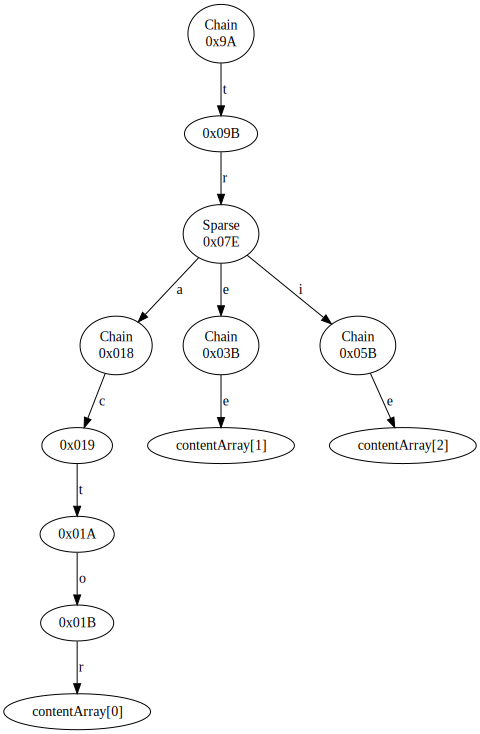
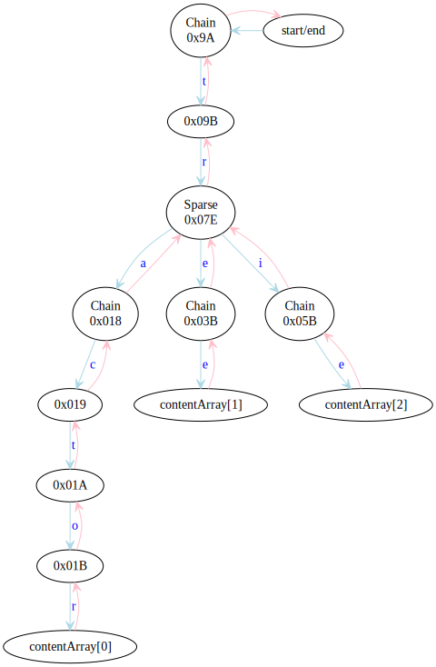
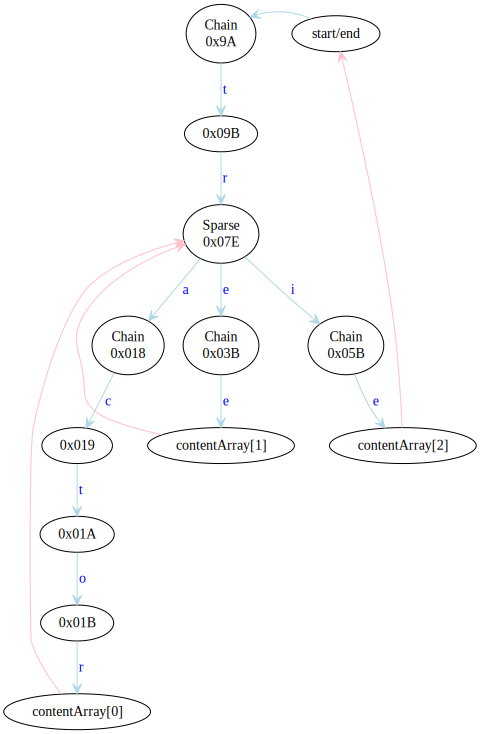
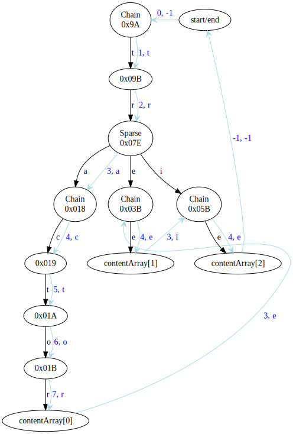
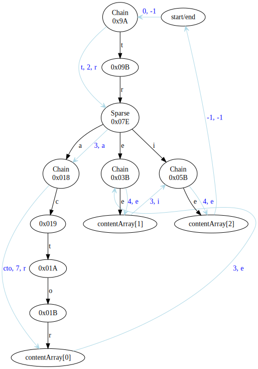

<!---
 Licensed to the Apache Software Foundation (ASF) under one
 or more contributor license agreements.  See the NOTICE file
 distributed with this work for additional information
 regarding copyright ownership.  The ASF licenses this file
 to you under the Apache License, Version 2.0 (the
 "License"); you may not use this file except in compliance
 with the License.  You may obtain a copy of the License at
 
     http://www.apache.org/licenses/LICENSE-2.0
 
 Unless required by applicable law or agreed to in writing, software
 distributed under the License is distributed on an "AS IS" BASIS,
 WITHOUT WARRANTIES OR CONDITIONS OF ANY KIND, either express or implied.
 See the License for the specific language governing permissions and
 limitations under the License.
-->

# `Trie` interface

Tries in Cassandra are used to represent key-value mappings in an efficient way, currently only for the partition map
in a memtable. The design we use is focussed on performing the equivalent of a read query, being able to most efficiently:
- combine multiple sources while maintaining order,
- restrict the combination to a range of keys,
- efficiently walk the result and extract all covered key-value combinations.

For this the `Trie` interface provides the following public methods:
- Consuming the content using `forEachValue` or `forEachEntry`.
- Conversion to iterable and iterator using `values/valuesIterator` and `entrySet/entryIterator`.
- Getting a view of the subtrie between a given pair of bounds using `subtrie`.
- Merging two or multiple tries together using `mergeWith` and the static `merge`.
- Constructing `singleton` tries representing a single key-to-value mapping.

The internal representation of a trie is given by a `Cursor`, which provides a method of walking the nodes of the trie 
in order, and to which various transformations like merges and intersections can be easily and efficiently applied.
The sections below detail the motivation behind this design as well as the implementations of the basic operations.

## Walking a trie

Walking a `Trie` is achieved using a cursor. Before we describe it in detail, let's give a quick example of what a
classic trie walk looks like and how it can be optimized. Suppose we want to walk the following trie:



(Note: the node labels are `InMemoryTrie` node IDs which can be ignored here, with the exception of `contentArray[x]` 
ones which specify that the relevant node has some associated content.)

The classic walk descends (<span style="color:lightblue">light blue</span>) on every character and backtracks 
(<span style="color:pink">pink</span>) to the parent, resulting in the following walk:



One can see from this graph that many of the backtracking steps are only taken so that they can immediately be followed
by another backtracking step. We often also know in advance that a node does not need to be examined further on the way
back: if it only has one child (which is always the case for all nodes in a `Chain`), or if we are descending into 
its last child (which is easy to check for `Sparse` nodes). This simplifies the walk to:



In addition to making the walk simpler, shortening the backtracking paths means a smaller walk state representation,
which is quite helpful in keeping the garbage collection cost down. In this example, the backtracking state of the walk
at the "tractor" node is only `[("tr", child 2)]`, changes to `[("tr", child 3)]` on descent to "tre", and becomes empty
(as "tr" has no further children and can be removed) on descent to "tri".  

One further optimization of the walk is to jump directly to the next child without stopping at a branching parent (note:
the black arrows represent the trie structure):



This graph is what a cursor walk over this trie is. Looking closely at the graph, one can see that it stops exactly once
on each node, and that the nodes are visited in lexicographic order. There is no longer a need for a separate backtrack
or ascend operation, because all arrows _advance_ in the representation of the trie. However, to be able to understand
where the next transition character sits in the path, every transition now also comes with information about the
descend-depth it ends in.

To see how this can be used to map the state to a path, we can imagine an array being filled at its `depth-1`th
position on every transition, and the current path being the `depth`-long sequence. This, e.g. the array would hold
[t, r, a, c, t, o, r] at the "tractor" node and change to [t, r, e, c, t, o, r] for the next advance, where the new 
current path is the first 3 characters of the array.

Cursors are stateful objects that store the backtracking state of the walk. That is, a list of all parent nodes in the
path to reach the current node that have further children, together with information which child backtracking should go
to. Cursors do not store paths as these are often not needed &mdash; for example, in a walk over a merged trie it makes 
better sense for the consumer to construct the path instead of having them duplicated in every source cursor. Multiple 
cursors can be constructed and operated in parallel over a trie.

Cursor walks of this type are very efficient but still carry enough information to make it very easy and efficient to
merge and intersect tries. If we are walking a single trie (or a single-source branch in a union trie), we can
improve the efficiency even further by taking multiple steps down in `Chain` nodes, provided we have a suitable
mechanism of passing additional transition characters:



This is supported by `Cursor.advanceMultiple`.

### Why cursors instead of nodes?

The most straightforward representation of a trie is done by giving users every `Node` visited as an object.
Then the consumer can query its transitions, get its children, decide to walk over them in any order it sees
fit, and retain those that it actually needs. This is a very natural and cheap represention if the nodes are actually 
the objects in memory that represent the trie.

The latter is not the case for us: we store tries in integer blobs or files on disk and we present transformed views of
tries. Thus every such `Node` object to give to consumers must be constructed. Also, we only do depth-first walks and it 
does not make that much sense to provide the full flexibility of that kind of interface.

When doing only depth-first walks, a cursor needs far fewer objects to represent its state than a node representation.
Consider the following for an approach presenting nodes:
- In a process that requires single-step descends (i.e. in a merge or intersection) the iteration state must create an
  object for every intermediate node even when they are known to require no backtracking because they have only one
  child. 
- Childless final states require a node.
- A transformation such as a merge must present the result as a transformed node, but it also requires a node for each
  input. If the transformed node is retained, so must be the sources.

Cursors can represent the first two in their internal state without additional backtracking state, and require only one
transformed cursor to be constructed for the entire walk. Additionally, cursors' representation of backtracking state 
may be closely tied to the specific trie implementation, which also gives further improvement opportunities (e.g. the 
`Split` node treatment in `InMemoryTrie`).

### Why not visitors?

A visitor or a push alternative is one where the trie drives the iteration and the caller provides a visitor or a 
consumer. This can work well if the trie to walk is single-source, but requires some form of stop/restart or pull
mechanism to implement ordered merges.

Push-style walks are still a useful way to consume the final transformed/merged content, thus `Trie` provides 
the `Walker` interface and `process` method. The implementations of `forEachEntry` and `dump` are straightforward
applications of this.

### The `Cursor` interface

The cursor represents the state of a walk over the nodes of trie. It provides three main features:
- the current `depth` or descend-depth in the trie;
- the `incomingTransition`, i.e. the byte that was used to reach the current point;
- the `content` associated with the current node,

and provides methods for advancing to the next position.  This is enough information to extract all paths, and
also to easily compare cursors over different tries that are advanced together. Advancing is always done in
order; if one imagines the set of nodes in the trie with their associated paths, a cursor may only advance from a
node with a lexicographically smaller path to one with bigger. The `advance` operation moves to the immediate
next, it is also possible to skip over some items to a specific position ahead (`skipTo`).

Moving to the immediate next position in the lexicographic order is accomplished by:
- if the current node has children, moving to its first child;
- otherwise, ascend the parent chain and return the next child of the closest parent that still has any.

As long as the trie is not exhausted, advancing always takes one step down, from the current node, or from a node
on the parent chain. By comparing the new depth with the one before the advance, one can tell if the former was 
the case (if `newDepth == oldDepth + 1`) or how many steps up we had to take (`oldDepth + 1 - newDepth`)  if it 
wasn't. When following a path down, the cursor will stop on all prefixes.

In addition to the single-step `advance` method, the cursor also provides an `advanceMultiple` method for descending
multiple steps down when this is known to be efficient. If it is not feasible to descend (e.g. because there are no
children, or because getting to the child of the first child requires a page fetch from disk), `advanceMultiple` will
act just like `advance`.

For convenience, the interface also provides an `advanceToContent` method for walking to the next node with non-null
content. This is implemented via `advanceMultiple`.

When the cursor is created it is placed on the root node with `depth() = 0`, `incomingTransition() = -1`. Since
tries can have mappings for empty, `content()` can possibly be non-null in the starting position. It is not allowed
for a cursor to start in exhausted state (i.e. with `depth() = -1`).

### Using cursors in parallel

One important feature of cursors is the fact that we can easily walk them in parallel. More precisely, when we use a 
procedure where we only advance the smaller, or both if they are equal, we can compare the cursors' state by:
- the reverse order of their current depth (i.e. higher depth first),
- if depths are equal, the order of their current incoming transition (lexicographically smaller first).

We can prove this by induction, where for two cursors `a` and `b` we maintain that:
1. for any depth `i < mindepth - 1`, `path(a)[i] == path(b)[i]`
2. if `a.depth < b.depth`, then `path(a)[mindepth - 1] > path(b)[mindepth - 1]`
3. if `a.depth > b.depth`, then `path(a)[mindepth - 1] < path(b)[mindepth - 1]`

where `mindepth = min(a.depth, b.depth)` and `path(cursor)` is the path corresponding to the node the cursor is
positioned at. Note that `path(cursor)[cursor.depth - 1] == cursor.incomingTransition`.

These conditions ensure that `path(a) < path(b)` if and only if `a.depth > b.depth` or `a.depth == b.depth` and 
`a.incomingTransition < b.incomingTransition`. Indeed, if the second part is true then 1 and 3 enforce the first,
and if the second part is not true, i.e. `a.depth <= b.depth` and (`a.depth != b.depth` or 
`a.incomingTransition >= b.incomingTransition`), which entails `a.depth < b.depth` or `a.depth == b.depth` and
`a.incomingTransition >= b.incomingTransition`, then by 2 and 1 we can conclude that `path(a) >= path(b)`, i.e. the
first part is not true either.

The conditions are trivially true for the initial state where both cursors are positioned at the root with depth 0.
Also, when we advance a cursor, it is always the case that the path of the previous state and the path of the new state 
must be the same in all positions before its new depth minus one'th. Thus, if the two cursors are equal before
advancing, i.e. they are positioned on exactly the same path, the state after advancing must satisfy condition 1 above
because the earliest byte in either path that can have changed is the one at position `min(a.depth, b.depth) - 1`.
Moreover, if the depths are different, the cursor with the lower one will have advanced its character in position
`depth - 1` while the other cursor's character at that position will have remained the same, thus conditions 2 and 3 are
also satisfied.

If `path(a)` was smaller before advancing we have that `a.depth >= b.depth`. The parallel walk will then only advance
`a`. If the new depth of `a` is higher than `b`'s, nothing changes in conditions 1-3 (the bytes before `b.depth` do 
not change at all in either cursor). If the new depth of `a` is the same as `b`'s, condition 1 is still satisfied
because these bytes cannot have changed, and the premises in 2 and 3 are false. If the new depth of `a` is lower
than `b`'s, however, `a` must have advanced the byte at index `depth - 1`, and because (due to 1) it was previously
equal to `b`'s at this index, it must now be higher, proving 2. Condition 1 is still true because these bytes cannot
have changed, and 3 is true because it has a false premise.

The same argument holds when `b` is the smaller cursor to be advanced.

### `encodedPosition` for efficient advance and position comparison

The cursor definitions above were given with separate `depth` and `incomingTransition` methods, but in practice we
combine the features of the current position into a single long integer that encodes the combination of the two. This
saves some method calls which often tend to be megamorphic, and also makes some checks more efficient.

The encoded state is prepared in such a way that it is trivially easy to compare the position of two cursors in parallel
walks: if the encoded state of one cursor is smaller than the encoded state of another, then it is positioned before it.
Recall that for a cursor to be positioned before another means either that its depth is higher than the other's, or that
depth match, and the incoming character is smaller. We can ensure that we can trivially compare by composing a long that
has the inverse of the depth as its most significant bits, and the incoming character in some of its less-significant
ones.

More precisely, in bits 32 to 63 of the `encodedPosition` long we store `-depth`, and in bits 20 to 27 &ndash;
`incomingTransition`. Some of the other bits have meanings that are descibed in the paragraphs below, and others 
are reserved for future use (e.g. we could set a bit to signify that the node at the
current position may have content to drastically reduce the number of `content` calls a consumer needs to do).
The `Cursor` class implements methods to compose and decompose encoded states, as well as to perform common checks
(e.g. whether an advance descended into a child position) and to prepare certain positions for skipping (e.g. over 
the current branch).

### Reverse iteration

Tries and trie cursors support reverse iteration. Because cursors have to stop on prefixes before visiting longer
sequences, the cursor walks described above performed in reverse have to differ from the reverse lexicographic order
because they will visit prefixes first (e.g. a trie representing the list "a", "ab", "c" will be walked as "c", "a",
"ab" in the reverse direction which is not the same as the reversed list). More precisely, reversed cursor walks as
described above will present data in lexicographic order of the inverted alphabet.

This difference is immaterial if the data in the trie is guaranteed to be prefix-free (e.g. when it is given by
Cassandra's byte-comparable type translation) and makes it possible to store metadata that describes features of the
descendant branch at any point in the trie and have that metadata presented correctly during reverse walks.

To make it easier to manipulate `encodedPosition` for reverse iteration, we use the 31st bit in the encoded state to
distinguish between forward and reverse iteration, and flip the bits of `incomingTransition` to make it possible to use
the same encoded state comparison for both iteration directions (because higher `incomingTransition` values should be
ordered before lower ones in reverse walks).

### Stopping on the ascent path

In some scenarios we may need reversed iteration that correctly presents reverse lexicographic order (e.g. SAI stores
terms in tries directly and is disadvantaged if the terms are not ordered correctly in reverse). For this reason, as
well as to support some needs of the set and range functionality that will be described later, the cursor interfaces
support stopping on a node on the ascent (i.e. return) path to present content. We call tries that present prefix
content on the return path in reverse "ordered tries". 

For example, the "a", "ab" and "c" example above will be iterated in forward direction as
```
a -> value for "a"
  b -> value for "ab"
c -> value for "c"
```
with normal reverse iteration
```
c -> value for "c"
a -> value for "a"
  b -> value for "ab"
```

In an ordered trie, the reverse iteration changes to
```
c -> value for "c"
a  ->
  b -> value for "ab"
a↑ -> value for "a"
```

The ascent path position (marked by the upwards arrow ↑ above) is one that is at the same depth of the matching descent
position, has the same incoming character and compares greater to it. This has the effect of being immediately after all
children of the node in cursor iteration order. In practical terms, we implement it by using bit 19 in the
`encodedPosition`. It is set to 0 for the descent path and 1 for the ascent path; unlike transition bits this is not
flipped for reverse iteration to ensure that it is visited after the descent path entry.

Return path positions are valid positions for jumps, and will be stopped on if a `skipTo` call finds one to be closest
to the requested position. They cannot have children.

Their usages will be further detailed in the [sections on sets](#trie-sets); there are also
[alternative approaches we considered during development](#return-stop-alternatives).

## Merging two tries

Two tries can be merged using `Trie.mergeWith`, which is implemented using the class `MergeCursor`. The implementation
is a straightforward application of the parallel walking scheme above, where the merged cursor presents the depth
and incoming transition of the currently smaller cursor, and advances by advancing the smaller cursor, or both if they
are equal.

If the cursors are not equal, we can also apply `advanceMultiple`, because it can only be different from `advance`
if it descends. When a cursor is known to be smaller it is guaranteed to remain smaller when it descends as its
new depth will be larger than before and thus larger than the other cursor's. This cannot be done to advance both
cursors when they are equal, because that can violate the conditions. (Simple example: one descends through "a" and 
the other through "bb" &mdash; condition 2. is violated, the latter will have higher depth but will not be smaller.)

## Merging an arbitrary number of tries

Merging is extended to an arbitrary number of sources in `CollectionMergeCursor`, used through the static `Trie.merge`.
The process is a generalization of the above, implemented using the min-heap solution from `MergeIterator` applied
to cursors.

In this solution an extra head element is maintained _before_ the min-heap to optimize for single-source branches
where we prefer to advance using just one comparison (head to heap top) instead of two (heap top to its two 
descendants) at the expense of possibly adding one additional comparison in the general case.

As above, when we know that the head element is not equal to the heap top (i.e. it's necessarily smaller) we can
use its `advanceMultiple` safely.

# Trie sets

The simplest way to implement a set in the trie paradigm is to define
an infinite trie that returns `true` for all positions that are covered by the set. Such a set is very easy to define
and apply, but unfortunately is not at all efficient because an intersection must necessarily walk the set cursor for
every covered position, which introduces a lot of overhead and makes it impossible to apply efficiency improvements such
as `advanceMultiple`.

Instead, our trie sets (defined in `TrieSet/TrieSetCursor`) implement sets of ranges of keys by listing the boundaries of
each range and their prefixes. This makes it possible to identify fully contained regions of the set and proceed inside
such regions without touching the set cursor.

Trie set cursors specify a `state` at any position they list. This state includes information about the inclusion of
trie branches before and after the listed position in iteration order. When we are applying a set to a trie (i.e.
intersecting the trie with it), we would walk the two cursors in parallel. If the set moves ahead, we use the state to
determine whether the position of the trie cursor is covered by the set. Similarly, when a `skipTo` is performed on the
set, the same state flags can tell us if the set covers the position we attempted to skip to, when the set cursor does
not have an exact match and skips over the requested position.

To support all forms of inclusivity and prefixes in the definition of the sets, set states can be presented both on the
descent and the ascent path of the walk. The preceding side of a descent path state applies to positions before the
node and its branch, while the succeeding side applies to the current node and positions greater than it in iteration
order, starting with its first children; similarly the preceding side of an ascent path state applies to preceding
positions including the last children of the current node as well as any ascent path content for the current node, and
the succeeding side applies to the positions that follow the node and branch.


## Trie set content

Trie sets list the boundary points for the represented ranges. For example, the range `[abc, ade)` will be represented
by the trie
```
a ->
  b ->
    c -> START
  d ->
    e -> END
```
where `START` is a state marking a left boundary, and `END` marks a right boundary. To be able to easily say that e.g.
`aa` is not covered by the set, but `ac` is, especially if we jump to these positions using a `skipTo` call, nodes on
any prefix path inside a covered range must also present a state that marks the node as contained on both sides. For
code simplicity sets also produce a state for prefixes that are fully outside the set.

The full state trie for the above example when walked in the forward direction is
```
a -> NOT_CONTAINED
  b -> NOT_CONTAINED
    c -> START
  d -> CONTAINED
    e -> END
```
The "contained" states are not reported by `content()`, but they are used to determine the inclusion of preceding
positions in the set. For example, when a cursor follows a `skipTo` instruction to jump to "aa" and lands on "ab", the
preceding side of `NOT_CONTAINED` tells it that the position the caller tried to skip to is not inside the set; on the
other hand, jumping to "ac" would land in "ad", whose `CONTAINED` state's preceding side tells us that the queried
position is covered by the set.

A set state only needs to specify a boolean for its two sides that specify whether the relevant positions are included
in the set. There are, thus, four possible set states:
- `NOT_CONTAINED` whose left and right side are both false,
- `CONTAINED` with true on both sides,
- `START` has false on the left and true on the right side,
- `END` is true on the left and false on the right side.

The left and right side of a state are presented, respectively, as preceding and succeeding when the cursor iterates in
the forward direction. In reverse, the right side is preceding and the left is the succeeding side. Note that when we
iterate a set in the reverse direction, the representation will differ in the states that it will return for some
prefixes of the boundaries, and in the presentation of boundaries. The example above is iterated as:
```
a -> NOT_CONTAINED
  d -> NOT_CONTAINED
    e↑ -> END
  b -> CONTAINED
    c↑ -> START
```
Note that for the content-bearing nodes (i.e. the boundaries "abc" and "ade"), the `state` is the same, but it is now
presented on the return path to state that the boundary applies after the specific position in iteration order. For the
prefixes "ad" and "ab" we must return different states in the two directions to ensure, e.g., that skipping to "ac"
(which ends up in "ad" in the forward direction and "ab" in the reverse) correctly interprets the position to be covered
by the set.

The example above is bounded by positions to the left of a given node, which are returned on the descent path in forward
direction, and on the ascent path in the reverse. In addition to this, our trie sets support positions to the right of a
node, to be able to specify sets that cover branches of the trie.

For example, the branch set `[abc, abc]` is represented in forward direction by the trie
```
a -> NOT_CONTAINED
  b -> NOT_CONTAINED
    c  -> START
    c↑ -> END
```
and
```
a -> NOT_CONTAINED
  b -> NOT_CONTAINED
    c  -> END
    c↑ -> START
```
in the reverse. To give this in a shorter form, ignoring the prefix states which can be inferred, this set is
represented by the trie
```
a ->
  b ->
    c< -> START
    c> -> END
```
where the `<` modifier in `c<` stands for the state that is returned on the descent path in forward direction, and on
the ascent path in the reverse, and vice versa for `>` in `c>`.

A few more complex examples:
- `[abd, adc] + (ade, afg)`:
  ```
  a ->
    b ->
      d< -> START
    d ->
      c> -> END
      e> -> START
    f ->
      g< -> END 
  ```
- `[a, abc] + [ade, a]` (in other words `[a, a] - (abc, ade)`):
  ```
  a< -> START
    b ->
      c> -> END
    d ->
      e< -> START
  a> -> END
  ```

## Converting ranges to trie sets

The main usage of a trie set is to return subtries bounded by one or more key ranges. We achieve this as the
intersection of a trie with a trie set that represents the ranges. The ranges are constructed by taking an array of
ordered boundaries, walking them in parallel the encoded position of the leftmost active key and presenting states as
follows:
- If the leftmost key has an odd index in the array, we are positioned to the right of a start boundary and thus must
  present a state that is true on the left side. Otherwise, the state must be false on the left.
- We set the right side to be the same as the left initially, and flip it for every key that ends at the current
  position. In other words, if one or an odd number of keys end here, we note that this is a boundary and changes the
  set containment for the positions to the right (note: two copies of the same boundary cancel out).

For the `[abc, adc) + [ade, afg)` example above, the ranges construction will accept the array `[abc, adc, ade, afg]`
and proceed as follows:
- We start with left index 0 at the root position (depth 0, character `\0`). As the left index is even, the state we
  must return is false on the left side. We check if any of the keys ends here, and since none does, the right side
  must be the same as the left, thus the state we return is `NOT_CONTAINED`.  
  We prepare for the next advance by getting the next byte from all keys.
- On the first `advance` call, we advance our encoded position to that of the key at the left index 0: (depth 1,
  character `a`). Since the left index is 0 (left excluded) and the left key does not end here, both sides must be false
  and thus the returned state is `NOT_CONTAINED`.  
  We prepare for the next advance by getting the next byte from all keys that match the current position, which matches
  all four.
- On the next `advance` call, we advance our encoded position to that of the key at the left index 0: (depth 2,
  character `b`). The left index is still 0 and no keys end here, thus we return the state `NOT_CONTAINED` again.  
  We prepare for the next advance by getting the next byte from all keys that match the current position, which is only
  key 0.
- On the next `advance` call, we advance our encoded position to that of the key at the left index 0: (depth 3,
  character `c`). The left index is still 0, but when we prepare for the next advance we see that this key has no more
  bytes and thus we must advance the left index to 1 and flip the right side of the state, resulting in `START`.
- On the next `advance` call, we advance our encoded position to that of the key at the left index 1: (depth 2, 
  character `d`). The left index is 1, thus the left side of the returned state must be true. No key ends here, thus
  the right side is left the same, resulting in `CONTAINED`.  
  We prepare for the next advance by getting the next byte from all keys that match the current position, keys 1 and 2.
- On the next `advance` call, we advance our encoded position to that of the key at the left index 1: (depth 3,
  character `c`). The left index is still odd, thus the left side is contained.  
  When we get the next byte of the only key at the matching position, we note that it is exhausted, increase the left
  index to 2 and flip the right side of the state, resulting in `END`.
- On the next `advance` call, we advance our encoded position to that of the key at the left index 2: (depth 3,
  character `e`). The left index is even, thus the left side is excluded.  
  This key doesn't have any further bytes either, thus we advance the left index to 3 and flip the right side, resulting
  in `START`.
- On the next `advance` call, we advance our encoded position to that of the key at the left index 3: (depth 2,
  character `f`). The left index is odd, thus our state's left side must be true.  
  We advance the matching keys (only key 3 remains), and since it does not end the state's right side is the same as
  the left, resuling in `CONTAINED`.
- On the next `advance` call, we advance our encoded position to that of the key at the left index 3: (depth 3,
  character `g`). The state's left side must be true for the odd left index.  
  The key has no further bytes, thus the left index is advanced to 4 and the right side is flipped to return `END`.
- On the next `advance` call the left index is beyond the end of the key array, thus we advance to the exhausted
  position (depth -1, character `\0`). Its state does not need to be defined as `state` and `content` cannot be called
  on exhausted cursors.

If we need to perform a `skipTo` operation, we do so by advancing the left index over the keys whose prepared position
is before the target. We then apply the same decisions using the new left index to prepare the resulting position and
state.

To handle inclusive end and exclusive start positions, we need to change the encoded position when a key returns its
last byte, just before it is exhausted, to be a position on the return path of the iteration. This is sufficient to
properly define a position on the right of the key. Note that this means that sets such as `[ab, cd, cd, ef]` are
invalid if all positions are understood to be inclusive, because the first right boundary `cd` inclusive falls after
the second left boundary `cd` inclusive in iteration order (the latter is on the descent path while the former is on the
ascent path of the same position). It also means that we can define contained sets such as `[a, ab, ax, a]` where the
`a` branch is covered except the `(ab, ax)` subset.

Reverse iteration is performed the same way on the reversed key array, expanded to even length by adding an inclusive
empty key if necessary. 

## Intersecting a trie with a trie set

Set intersection is performed by walking the source and set with a parallel walk. If the set advances beyond the
position of the trie, we check the state of the set to see if the position is covered by the set (done by
`TrieSetCursor.precedingIncluded`). If it is, we can present all content in the trie until it catches up with the set
position, and we can also apply `advanceMultiple` as a direct call on the trie. If the position is not covered by the
set, we perform a `skipTo` call to the current position of the set. This may move beyond the current position of the
set, so we must skip the set to the new position, and then repeat the above steps.

If at any point both trie and set are at the same position, we can report that position and advance both trie and set
on the next `advance` or `skipTo` call. In this case `advanceMultiple` cannot be used and must act as `advance`.

### Presenting content at prefixes, subtrie and slice intersections

The intersection of a trie with a set results in the restriction of the trie data to the coverage of the set. One
important question for this intersection is what content should be returned by the intersected trie.

As mentioned previously, we very often want to be able to see metadata like level markers on the descent path of the
iteration regardless of the direction, to be able to recognize features that apply to the branch. For this to work
correctly, we also want metadata to be presented on prefixes that are not strictly contained in the set. For example,
if "a" contains metadata related to the full contained branch, we would need that metadata to be presented when we
intersect the trie containing "a" with e.g. the set `[abc, ade)`. To facilitate this, the normal trie intersection will
return the content of all nodes visited by the walk, i.e. for all prefixes of content in the queried set. Additionally,
inclusive ends and exclusive starts apply to the whole branch rooted at the given boundary position (implemented by the
`>` modifiers for the boundaries as shown above).

On the other hand, to support ordered tries and queries, which should only return content that falls between the given
lexicographical boundaries, we also provide a "slice" intersection. This type of intersection only returns content that
is strictly inside the set. For the `[abc, ade)` example, this includes e.g. "abc", "ac", "acc", "ad", "adc" but
excludes "a" and "ab".

Slice intersections only make sense if the trie they are applied to is ordered (i.e. if the content is returned on the
ascent path in the reverse direction) and need to also use a different form of preparation of inclusive ends and
exclusive starts: slices should not contain any children of an inclusive end (because they follow the boundary in
lexicographic order) and should not skip over the children of an exclusive start. This is achieved by presenting
exclusive start / inclusive end positions as the path with a zero byte appended at the end, always using
`<` modifiers.

For example, the trie set representing the slice `[abc, adc] + (ade, afg)` is:
```
a ->
  b ->
    c< -> START
  d ->
    c ->
      \0< -> END
    e ->
      \0< -> START
  f ->
    g< -> END  
```
Note that when such a set is walked in the reverse direction, all boundaries are presented on the return path of the
iteration.


## Set algebra

A variation of the above can also be applied to sets, giving us set intersections.

We can also perform negation of a set by inverting the returned states, as well as adding or removing boundaries at the
root on both the descent and ascent path. For example, the inverse of the range `[abc, ade]` is the set 
`[null, abc) + (ade, null]`, which is represented as
```
< -> START
a ->
  b ->
    c< -> END
  d ->
    e> -> START
> -> END
```

Using De Morgan's law, the negation also lets us perform set union.

# Range tries

A range trie is a generalization of the trie set, where the covered ranges can come with further information. This is
achieved by turning each side of a state from a boolean signifying containment to an object that carries additional
information.

Nodes fully contained inside a trie range must return states that have the same left and right side. To simplify coding,
we name these kinds of states "covering" and use them as the information-bearing object that a state must return.

In other words, states' `precedingState` and `succeedingState` methods return a state. On "boundary" states, where the
carried data changes (or a new range starts/stops), the two sides are a different covering state or null. Covering
states, on the other hand, specify fully contained regions and return themselves for both the preceding and succeeding
side.

In their simplest, a range trie is one that returns `content` for the boundary positions of the ranges, and also
implements a `precedingState` method that returns the range state that applies to positions before the cursor's. For
a little better efficiency most of the time we combine these two into the `state` method that returns the content, if
the position is a boundary, or the preceding state otherwise. This suffices to implement the required operations,
including:
- Intersecting a range trie with a trie set, which generates boundaries that match the closer of the range trie's or
  the set's.
- Combining two range tries in a union, where the applicable covering state is applied to every content position
  given to the merge resolver.
- Inserting ranges into an in-memory range trie, applying new ranges to existing content as well as existing ranges to
  new content to have the same result as the union above.
- The above also form the basis of the application of range tries to data, e.g. applying deletions as range tries to
  content tries.

For the examples below, consider range states that specify deletion times. For example, a range trie could be used to
describe a deletion with timestamp 555 that applies to the range `[abc, adc]` as
```
a ->
  b ->
    c< -> start(555)
  d ->
    c> -> end(555)
```

This dump only lists the content of the range trie. This information is sufficient to track the deletion state if we
are advancing through the cursor in either direction without skipping, but isn't sufficient to know what deletion state
applies if the user needs to `skipTo` positions inside the trie. For example, if a cursor is positioned on "a" and the
user performs `skipTo(2, c)` to advance to "ac", this range cursor does not list this position but must still be able to
present the fact that the requested position is covered by the deletion 555. This is achieved by the `precedingState`
reported by the cursor.

If we also include the preceding state by reporting all `state` values, the trie will look like this in the forward
direction:
```
a ->
  b ->
    c  -> start(555)
  d -> covering(555)
    c↑ -> end(555)
```
and like this in the reverse:
```
a ->
  d ->
    c  -> end(555)
  b -> covering(555)
    c↑ -> start(555)
```
This ensures that when we skip to any position between the two bounds, the position where the cursor ends up (either
"ad" or "adc" in forward direction, "ab" or "abc" in the reverse) has 555 as its preceding deletion state. Note that any
content must be the same in both directions, but preceding state applies to preceding positions in iteration order and
thus will be different in the two directions.

The range state used in this representation will be such that `start(dt)` has a `null` state on the left (i.e. returned
by `precedingState(FORWARD)`) and has `covering(dt)` on the right (`precedingState(REVERSE)`), `end(dt)` has
`covering(dt)` on the left and `null` on the right. `covering(dt)` is a covering state that returns itself for the
preceding state in both directions. To support touching ranges, we also need a `switch(ldt, rdt)` state that has
`covering(ldt)` on the left and `covering(rdt)` on the right.

## Slice / set intersection of range tries

Intersection of range tries is performed by the same process as normal trie set intersection, augmented by information
about the covering states of every position. If positions are completely covered by the set, we report the range
cursor's `state/precedingState/content` unmodified. If the position falls on a prefix or a boundary of the set, we throw
away (using the `restrict` method) parts that do not fall inside the set. The latter may also happen if the position
is not one present in the range trie, but covered by a range (i.e. where `skipTo` went beyond the set cursor's position
and the range cursor's `precedingState` returned covering state): in this case we may apply the covering state's
`asBoundary` method to promote it to a boundary where the set forms substructure in the covered range.

Imagine that we want to intersect the range trie above with the range `[aaa, acc]`, which looks like this as in the
forward direction:
```
a -> NOT_CONTAINED
  a -> NOT_CONTAINED
    a  -> START
  c -> CONTAINED
    c↑ -> END
```

The intersection cursor will first visit the root and the position "a", where in both cases it will find `null` range
cursor state, resulting in an `null` state for the intersection. The next position "aa" is present in the set, but not
in the range, thus the `skipTo` operation on the range advances to "ab", whose `precedingState` is null. This means that
there is nothing to intersect in the "aa" branch and anything before the range cursor's position, thus we continue by
skipping the set cursor to "ab". This positions it at "ac", whose state is `CONTAINED` and thus its preceding side
is `true`. This means that we must report all branches of the range cursor that we see until we advance to or beyond the
set's position. The intersection cursor is positioned at the range cursor's "ab" position. It does not have any `state`
for it, so the intersection cursor reports `null` state as well.

On the next advance we descend to "abc" (which by virtue of descending is known to fall before the set cursor's
position) and report the range cursor's `start(555)` state unchanged, resulting also in the same `content` and `null`
as `precedingState` (because `start(dt)` has `null` on its left (preceding in forward direction) side).

The next advance takes the range cursor to "ad", which is beyond the current set cursor position. We check the range
cursor's `precedingState` and find that it is `covering(555)`. Since at this point we have a preceding state, we need to
walk the set branch and use it to augment and report the active covering state. The intersection cursor remains at the
set cursor's "ac" position, and must report the active `covering(555)` augmented by the set cursor's `CONTAINED` state.
This means that we can report the range state unchanged at this position, and thus `covering(555)` is reported as the
state and `null` as the `content` (because `covering(dt)` is not a boundary state).

On the next advance, the intersection cursor follows the earlier of the two cursors, which is the set cursor. This
advances it to "acc↑", which is a boundary of the set with state `END`. The active covering state is still
`covering(555)`; augmenting it with `END` turns it into the boundary `end(555)`, which is reported in `state` as
well as `content` (because `start(dt)` is a boundary state). `precedingState` reports the left side of this boundary,
which is still `covering(555)`.

The next advance takes the set to the exhausted position, which completes the intersection.

The resulting forward walk of the trie looks as expected:
```
a ->
  b ->
    c  -> start(555)
  c -> covering(555)
    c↑ -> end(555)
```

## Union of range tries

The merge process is similar (with a second range trie instead of a set), but we walk all branches of both tries and
combine their states. There are two differences from the normal trie merge process:
- We apply the merge resolver to states instead of content. This includes both content and preceding state, which is
  necessary to be able to report the correct state for the merged trie.
- When one of the range cursors is ahead, we pass its `precedingState` as an argument to the merge resolver to modify
  all reported states.

As an example, consider once again the `[abc, adc]` range with deletion 555, merged with the following trie for the
`[aaa, acc]` range with deletion 666:
```
a ->
  a ->
    a  -> start(666)
  c -> covering(666)
    c↑ -> end(666)
```

The merge cursor will first proceed along "aaa" where the first source (advancing to "ab") does not have any
`precedingState`, and thus the merge reports "null" for "", "a" and "aa", and the `start(666)` state for "aaa"
unchanged. On the next advance this source moves beyond the other cursor's "ab" position. The merge thus follows the
second source, but the first has a `precedingState` of `covering(666)`, which must be reflected in the reported states.
The second cursor has no `state` for "ab", thus the merge reports `covering(666)` as the state for "ab".

The next advance takes the second source to "abc", with `start(555)` state. The merge resolver is called with
`start(555)` and `covering(666)` as arguments. Typically, the resolvers we use drop smaller deletion timestamps, so
this returns `covering(666)` unchanged.

The next advance takes the second source to "ad", which is beyond the current position of the first source. The merge
cursor switches to following the first source, positioned at "ac", with `covering(666)` as the `state`, but
it must also reflect the second sources `covering(555)` preceding state. The resolver is called with these two
arguments and once again returns the bigger deletion timestamp, `covering(666)`.

The next advance takes the first source and the iteration cursor to "acc↑", where this source has the `end(666)`
boundary as state. The merge resolver is called with `end(666)` and `covering(555)`. This time the covering state does
not override the boundary, thus the resolver must create a state that reflects the end of the current range, as
well as the fact that we continue with the other covering state. It must thus return the boundary state 
`switch(666, 555)` which the intersection cursor reports.

The next advance takes the first source to the exhausted position. The merge thus reports all paths and state from the
other cursor unchanged until it is exhausted as well, i.e. `covering(555)` for "ad" and `end(555)` for "adc".

The final resulting trie looks like this:
```
a ->
  a ->
    a -> start(666)
  b -> covering(666)
    c -> covering(666)
  c -> covering(666)
    c -> switch(666, 555)
  d -> covering(555)
    c -> end(555)
```
Note that the "abc" path adds no information. We don't, however, know this before descending into that branch, thus we
can't easily remove it. This could be done using a special `cleanup` operation over a trie which must buffer descents
until effective content is found, which is best done as a separate transformation rather than as part of the merge.

## Relation to trie sets

`TrieSetCursor` is a subclass of `RangeCursor`, and the trie set is a special case of a range trie that simply adds
boolean versions of the `precedingState` methods.

# Deletion-Aware Tries

Deletion-aware tries are designed to store live data together with ranges of deletions (aka tombstones) in a single
structure, and be able to apply operations over them that properly restrict deletion ranges on intersections and apply
the deletions of one source to the live content of others in merges.

Our deletion-aware tries implement this by allowing nodes in the trie to offer a "deletions branch" which specifies
and encloses the deletion ranges applicable to the branch rooted at that node. This can be provided at any level of the
trie, but only once for any given path (i.e. there cannot be a deletion branch under another deletion branch). In many
practical usecases the depth at which this deletion path is introduced will also be predetermined for any given path;
merges implement an option that exploits this property to avoid some inefficiencies.

It is also forbidden for live branches to contain data that is deleted by the trie's own deletion branches (aka
shadowed data).

Perhaps the easiest way to describe the approach is to discuss its alternatives and the reasons we preferred the
structure and features of the option we went with.

### Why not mix deletion ranges with live data?

In this approach we store deletions as ranges, and live data as point ranges in the single structure. They are ordered
together and, to facilitate an efficient `precedingState`, points need to specify the applicable deletions before and
after the point. This approach is an evolution of Cassandra's `UnfilteredRowIterator` that mixes rows and tombstone
markers.

The example below represents a trie that contains a deletion from `aaa` to `acc` with timestamp 666, and a live point at
`abb` with timestamp 700 in this fashion:
```
a ->
  a ->
    a -> start(666)
  b -> covering(666)
    b -> data(value, 700) + switch(666, 666)
  c -> covering(666)
    c -> end(666)
```

Having the point also declare the state before and after makes it easy to obtain the covering deletion e.g. for `aba`,
`abc` or `ab`. This is a very acceptable amount of overhead that isn't a problem for the approach.

The greatest strength of this approach is that it makes it very easy to perform merges because all the necessary
information is present at any position that the merging cursor visits.

The reason to avoid this approach is that we often want to find only the live data between a given range of keys, or the
closest live entry after a given key. In an approach like this we can have many thousands of deletion markers that
precede the live entries, and to find it we have to filter these deletions out.

In fact, we have found this situation to occur often in many practical applications of Cassandra. Solving this problem
is one of the main reasons to implement the `Trie` machinery.

This problem could be worked around by storing metadata at parent nodes whose branches don't contain live data; we went
with a more flexible approach.

### Why not store live data and deletions separately?

In the other extreme, we can have two separate tries. For the example above, it could look like this:
```
LIVE
b ->
  b -> data(value, 700)
DELETIONS
a ->
  a ->
    a -> start(666)
  c -> covering(666)
    c -> end(666)
```

To perform a merge, we have to apply the DELETIONS trie of each source to the other's LIVE trie. In other words, a merge
can be implemented as
```
merge(a, b).LIVE = merge(apply(b.DELETIONS, a.LIVE), apply(a.DELETIONS, b.LIVE))
merge(a, b).DELETIONS = merge(a.DELETIONS, b.DELETIONS)
```
or (which makes better sense when multiple sources are merged):
```
d = merge(a.DELETIONS, b.DELETIONS)
merge(a, b).LIVE = apply(d, merge(a.LIVE, b.LIVE))
merge(a, b).DELETIONS = d
```

This can create extra complexity when multiple merge operations are applied on top of one another, but if we select all
sources in advance and merge them with a single collection merge the method's performance is good.

This solves the issue above: because we query live and deletions separately, we can efficiently get the first live item
after a point. We can also get the preceding state of a deletion without storing extra information at live points.

The approach we ultimately took is an evolution of this to avoid a couple of performance weaknesses. On one hand, it is
a little inefficient to walk the same path in two separate tries, and it would be helpful if we can do this only once
for at least some part of the key. On the other, there is a concurrency chokepoint at the root of this structure, because
whenever a deletion actually finds live data to remove in an in-memory trie, to achieve atomicity of the operation we
need to prepare and swap snapshots for the two full tries, which can also waste work and limits caching efficiency.

In Cassandra we use partitions as the unit of consistency, and also the limit that range deletions are not allowed to
cross. It is natural, then, to split the live and deletion branches at the partition level rather than at the trie root.

### Why not allow shadowed data, i.e. data deleted by the same trie's deletion branches?

One way to avoid the concurrency issue above is to leave the live data in place and apply the deletion trie on every
query. This does ease the atomicity problem, and in addition makes the merge process simpler as we can independently
merge data and deletion branches.

However, we pay a cost on live data read that is not insignificant, and the amount of space and effort we must spend
to deal with the retained data items can quickly compound unless we apply garbage collection at some points. We prefer
to do that garbage collection as early as possible, by not introducing the garbage in the first place.

There is a potential application of relaxing this for intermediate states of transformation, e.g. by letting a merge
delay the application of the deletions until the end of a chain of transformations. This is an internal implementation
detail that would not change the requirements for the user.

### Why not allow nested deletion branches?

If it makes sense to permit deletion branches, then we could have them at multiple levels, reducing the amount of path
duplication in the trie.

For example, using a deletion branch we can represent the example above as
```
a ->
  *** start deletion branch
  a ->
    a -> start(666)
  c -> covering(666)
    c -> end(666)
  *** end deletion branch
  b ->
    b -> data(value, 700)
```

and if we then delete `aba-abc` with timestamp 777, represented as
```
a ->
  b ->
    *** start deletion branch
    a -> start(777)
    c -> end(777)
    *** end deletion branch
```
we could merge it into the in-memory trie as
```
a ->
  *** start deletion branch
  a ->
    a -> start(666)
  c -> covering(666)
    c -> end(666)
  *** end deletion branch
  b ->
    *** start deletion branch
    a -> start(777)
    c -> end(777)
    *** end deletion branch
```

This can work well for point queries and has some simplicity advantages for merging, but introduces a
complication tracking the state when we want to walk over a range and apply deletion branches to data. The problem is
that we don't easily know what deletion state applies e.g. when we advance from `abc` in the trie above; we either have
to keep a stack of applicable ranges, or store the deletion to return to in the nested deletion branch, which would
cancel out the simplicity advantages.

### Why predetermined deletion levels (`deletionsAtFixedPoints`) are important

The case above (nested deletion branches) is something that can naturally occur in merges, including as shown in the
example. If we don't do anything special, this merge would create a nesting of branches.

We fix this problem by applying "hoisting" during merges, i.e. by bringing other sources' covered deletion branches to
the highest level that one source defines it. For the example above, this means that when the merged cursor encounters
the in-memory deletion branch at `a`, it has to hoist the mutation's deletion to be rooted at `a` rather than `ab`.

In other words, the mutation is changed to effectively become
```
a ->
  *** start deletion branch
  b ->
    a -> start(777)
    c -> end(777)
  *** end deletion branch
```

which can then be correctly combined into
```
a ->
  *** start deletion branch
  a ->
    a -> start(666)
  b -> covering(666)
    a -> switch(666, 777)
    c -> switch(777, 666)
  c -> covering(666)
    c -> end(666)
  *** end deletion branch
```

The hoisting process can be very inefficient. The reason for this is that we do not know where in the source trie a
deletion branch is defined, and to bring them all to a certain level we must walk the whole live branch. If e.g. this
in-memory trie never had a deletion before, this could mean walking all the live data in the trie, potentially millions
of nodes.

Provided that the result of this hoisting becomes a new deletion branch, which would be the case for in-memory tries,
one can say that the amortized cost is still O(1) because once we hoist a branch we never have to walk that branch
again. The delay of doing that pass could still cause problems; more importantly, in merge views we may have to do that
multiple times, especially on nested merges.

To avoid this issue, deletion-aware merges accept a flag called `deletionsAtFixedPoints`. When this flag is true, the
merge expects that all sources can only define deletion branches at matching points. If this is guaranteed, we do not
need to do any hoisting, because a covered deletion branch cannot exist. We expect most practical uses of this class to
perform all merges with this flag set to true.

This means preparing deletions so that they always share the same point of introduction of the deletion branch. For the
example above it means preparing the deletion in the hoisted form. In Cassandra, for example, this can be guaranteed 
by wiring the deletion branches to always be on the partition level.

# Appendices

## Return stop alternatives

We considered two alternatives to the ascent/return path stops that we use in our cursors. The two are conceptually
simpler, but come with higher implementation costs.

The first alternative is to use trailing "type" modifier bits for the positions the cursor stops at:
- "<" (00) for positions to the left of content and branch (left-inclusive or right-exclusive boundaries)
- "=" (01) for ordered content of a node
- "↓" (10) for any children of the branch, and also metadata that should be reported for the branch
- ">" (11) for positions to the right of content and branch (left-exclusive or right-inclusive boundaries)

This is conceptually simpler because these modifiers do not change when we iterate the trie cursor in reverse, but are
simply walked in the reverse order (which is achieved by flipping the modifier bits together with the transition bits).
The difference with the "return path" approach that we chose is that the latter needs these to be bundled in a different
way depending on whether we are iterating in the forward or reverse iteration:
- on forward iteration, <, = and ↓ must be bundled on the descent path, and > on the ascent;
- on reverse iteration, > and ↓ must be bundled on the descent path, and = and < on the ascent.

The main reason we could not use the modifier option is the fact that we need tail tries, and that we usually recognize
the need to form a tail trie by some content given for the ↓ metadata modifier. As cursors (especially after
transformations like unions) will have advanced beyond the < boundary and = content modifier, but we need to present
the boundaries and/or content in the returned tail trie, this would have added enormous complications to the tail trie
functionality.

The ascent path approach always bundles metadata with the descent path content, meaning that we are correctly positioned
to take a tail trie when we recognize the need for one.

The other alternative we considered involves presenting virtual content-bearing child nodes for the boundaries and
ordered content using out-of-range transition values. For example, we could use the transitions `-2` for
left-inclusive/right-exclusive boundaries, `-1` for ordered content and `256` for left-exlusive/right-inclusive
boundaries, to lead us to implicit positions that contain the relevant attached value. By expanding the encoded position
part for the transition by two leading bits we can easily accommodate this without changing any of the transformation
implementations.

This approach does not have a problem with tail tries, but would be a little less performant because of the additional
descent that would be required for all boundaries of range/trie sets and content in ordered tries.