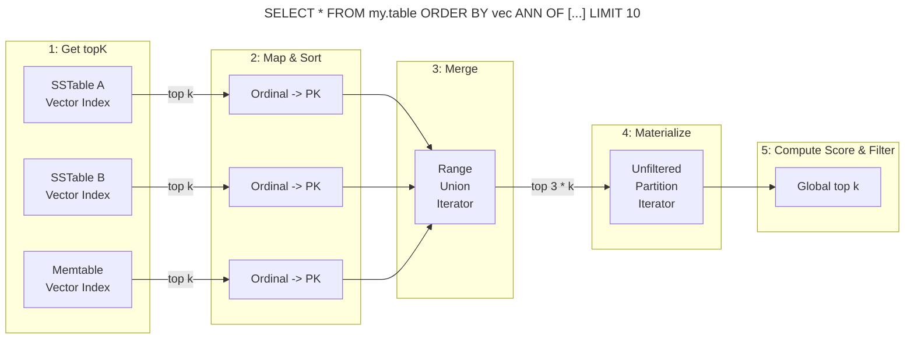
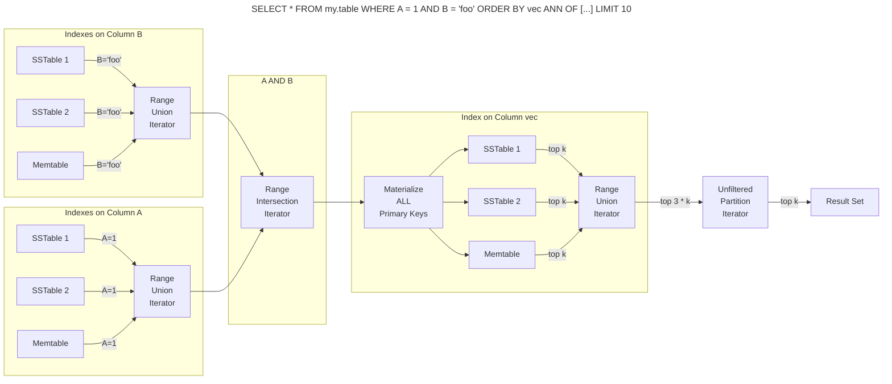

# SAI Vector ANN Query Execution

## Storage-Attached Index Basics

* We can create indexes on columns to support searching them without requiring `ALLOW FILTERING` and without requiring
that they are part of the primary key
* A column's index translates to a local index for each memtable and each sstable segment within the table
* Query execution scatters across each index to get the collection of Primary Keys that satisfy a predicate
* Each sstable segment's index is immutable
* Memtable indexes are mutable and are updated as the memtable is updated

## Vector Index Basics

* A vector index gives us the ability to search for similar vectors
* We take advantage of the fact that each sstable segment is immutable and finite
* If we take the top k vectors from each sstable segment, we can materialize them from storage and get the top k vectors
  from the entire table (more on this later)
* The `K` in `topK` is generally the `LIMIT` of the query, but can be larger (more on this later)

## Query Types

### Vector Only Query

When a query is only limited by ANN, the query execution is very simple. The execution follows this path:
1. Query each sstable's vector index(es) to get the top k vectors, which are represented as ordinals.
2. Map ordinals to Primary Keys and sort into ascending Primary Key order to simplify deduplication.
3. Merge/deduplicate the result with a `RangeUnionIterator` while maintaining PK ordering. Produces up to `3 * k` PKs.
4. Materialize each row from storage.
5. Compute the vector similarity score for each row to get the top k rows for the whole table.

Notes:
* Range queries on the Primary Key that do not require an index are supported and are considered ANN only.
* `ALLOW FILTERING` is not supported.

### Pre-fitered Boolean Predicates Combined with ANN Query

When a query has both boolean predicates and an ANN ordering predicate, the query execution is more complex. The execution
of query `SELECT * FROM my.table WHERE A = 1 AND B = 'foo' ORDER BY vec ANN OF [...] LIMIT 10` follows this path:
1. Query each boolean predicate's index to get the Primary Keys that satisfy the predicate.
2. Merge the results with a `RangeUnionIterator` that deduplicates results for the predicate and maintains PK ordering.
3. Intersect the results with a `RangeIntersectionIterator` to get the Primary Keys that satisfy all boolean predicates.
4. Materialize the Primary Keys that satisfy all boolean predicates.
5. Map those predicates back to each vector index and search for the top k vectors. **This is expensive.**
6. Materialize each row from storage.
7. Compute the vector similarity score for each row.
8. Return the top k rows.

