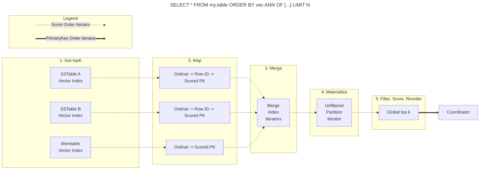
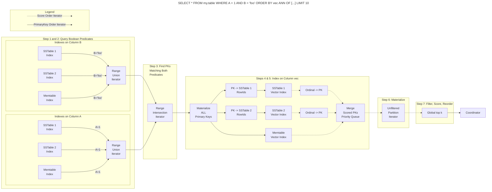

<!--
# Copyright DataStax, Inc.
#
# Licensed under the Apache License, Version 2.0 (the "License");
# you may not use this file except in compliance with the License.
# You may obtain a copy of the License at
#
#     http://www.apache.org/licenses/LICENSE-2.0
#
# Unless required by applicable law or agreed to in writing, software
# distributed under the License is distributed on an "AS IS" BASIS,
# WITHOUT WARRANTIES OR CONDITIONS OF ANY KIND, either express or implied.
# See the License for the specific language governing permissions and
# limitations under the License.
#
-->

# SAI Vector Graph Construction Configuration Options

## Basic Configuration

The following options can be specified when creating a SAI vector index:

| Option                   | Default                                                              | Valid Range                               | Description                                                                                                                                                                                      |
|--------------------------|----------------------------------------------------------------------|-------------------------------------------|--------------------------------------------------------------------------------------------------------------------------------------------------------------------------------------------------|
| maximum_node_connections | 16                                                                   | 1-512                                     | Controls the maximum number of connections per node in the graph. The actual graph degree will be 2x this value. Higher values increase graph quality but also increase storage and query costs. |
| construction_beam_width  | 100                                                                  | 1-3200                                    | Controls how many candidates to evaluate during graph construction. Higher values increase graph quality but also increase build time.                                                           |
| neighborhood_overflow    | 1.0 in memtable, 1.2 in compaction                                   | > 0                                       | Controls graph pruning during construction. Higher values result in denser graphs.                                                                                                               |
| alpha                    | dimesion > 3 gets 1.2. Otherwise, 2.0 in memtable, 1.4 in compaction | > 0                                       | Controls how aggressively to explore the graph during search. Higher values increase recall at the cost of latency.                                                                              |
| enable_hierarchy         | false                                                                | true/false                                | When true, enables hierarchical graph construction.                                                                                                                                              |
| source_model             | `OTHER`                                                              | enum (see [below](#vector-source-models)) | Preset configurations optimized for specific vector embedding models.                                                                                                                            |
| similarity_function      | (from `source_model`)                                                | `COSINE`, `DOT_PRODUCT`, `EUCLIDEAN`      | Defines how vector similarity is computed.                                                                                                                                                       |

### Example Usage

Basic index creation with defaults:
```cql
CREATE CUSTOM INDEX ON mytable (vec_col)
USING 'StorageAttachedIndex';
```

Setting some options:
```cql
CREATE CUSTOM INDEX ON mytable (vec_col)
USING 'StorageAttachedIndex'
WITH OPTIONS = {
    'maximum_node_connections': '32',
    'construction_beam_width': '200'
};
```

Setting all options:
```cql
CREATE CUSTOM INDEX ON mytable (vec_col)
USING 'StorageAttachedIndex'
WITH OPTIONS = {
    'maximum_node_connections': '32',
    'construction_beam_width': '200',
    'neighborhood_overflow': '1.2',
    'alpha': '1.1',
    'enable_hierarchy': 'true',
    'similarity_function': 'COSINE',
    'source_model': 'ADA002'
};
```

## Vector Source Models

The source_model option provides preset configurations optimized for specific vector embedding models. Each model affects:
- Default similarity function
- Compression settings
- Overquery behavior during search

Available models:

| Model           | Similarity  | Compression    | Overquery Factor | Notes                                    |
|-----------------|-------------|----------------|------------------|------------------------------------------|
| ADA002          | DOT_PRODUCT | PQ (0.125)     | 1.25x            | Optimized for OpenAI Ada-002 embeddings  |
| OPENAI_V3_SMALL | DOT_PRODUCT | PQ (0.0625)    | 1.5x             | For text-embedding-3-small               |
| OPENAI_V3_LARGE | DOT_PRODUCT | PQ (0.0625)    | 1.25x            | For text-embedding-3-large               |
| BERT            | COSINE      | PQ (0.25)      | 1.0x             | For BERT-style embeddings                |
| GECKO           | DOT_PRODUCT | PQ (0.125)     | 1.25x            | For Cohere Gecko embeddings              |
| NV_QA_4         | DOT_PRODUCT | PQ (0.125)     | 1.25x            | For NVIDIA NeMo embeddings               |
| COHERE_V3       | DOT_PRODUCT | PQ (0.0625)    | 1.25x            | For Cohere V3 embeddings                 |
| OTHER           | COSINE      | Auto-scaled PQ | Dynamic          | Generic configuration for unknown models |

The `OTHER` model uses dimension-based heuristics to automatically determine appropriate compression settings and adjusts overquery based on compression ratio:
- High compression (>16x): 1.5x overquery
- Standard compression: 1.0x overquery

# SAI Vector ANN Query Options

## Query-Time Configuration

Vector similarity searches can be fine-tuned at query time using the `WITH ANN_OPTIONS` clause. These options allow you to balance between search accuracy (recall) and performance (latency).

| Option      | Default                                                                                                                       | Valid Range                         | Description                                                                                                                                                                                                                                                                         |
|-------------|-------------------------------------------------------------------------------------------------------------------------------|-------------------------------------|-------------------------------------------------------------------------------------------------------------------------------------------------------------------------------------------------------------------------------------------------------------------------------------|
| rerank_k    | value computed based on `LIMIT`, configured [source_model](#vector-source-models), and number of vector graphs being searched | ≤ 0 or > LIMIT (up to guardrail) | The number of candidates to collect before reranking. Values ≤ 0 disable reranking. Higher values increase recall at the cost of latency. Subject to guardrail `sai_ann_rerank_k_max_value`. |
| use_pruning | true                                                                                                                          | true/false                          | When enabled, allows the search to skip parts of the graph that are unlikely to contain good matches. Can improve latency by possibly reducing recall.                                                                                                                              |

### Example Usage

> **IMPORTANT**: ANN_OPTIONS comes after LIMIT in the query text.
The following examples show the correct ordering.

Basic vector search with default options:
```sql
SELECT * FROM mytable
ORDER BY vec ANN OF [1.0, 2.0, 3.0]
LIMIT 10;
```

Setting rerank_k to improve recall:
```sql
SELECT * FROM mytable
ORDER BY vec ANN OF [1.0, 2.0, 3.0]
LIMIT 10
WITH ANN_OPTIONS = {'rerank_k': 100};
```

Setting rerank_k to disable reranking:
```sql
SELECT * FROM mytable
ORDER BY vec ANN OF [1.0, 2.0, 3.0]
LIMIT 10
WITH ANN_OPTIONS = {'rerank_k': 0};
```


Enabling pruning to improve latency:
```sql
SELECT * FROM mytable
ORDER BY vec ANN OF [1.0, 2.0, 3.0]
LIMIT 10
WITH ANN_OPTIONS = {'use_pruning': true};
```

Setting all options:
```sql
SELECT * FROM mytable
ORDER BY vec ANN OF [1.0, 2.0, 3.0]
LIMIT 10
WITH ANN_OPTIONS = {
    'rerank_k': 100,
    'use_pruning': true
};
```

## Performance Considerations

### Reranking (rerank_k)

The `rerank_k` parameter controls the trade-off between search accuracy and latency:

- Higher values (e.g., 2-4x LIMIT):
    - Increased recall (more accurate results)
    - Higher latency due to deeper graph exploration
    - Increased memory usage during search
    - More I/O operations

- Lower values (closer to LIMIT):
    - Faster searches
    - Lower memory usage
    - Potentially lower recall
    - Fewer I/O operations

- Rerankless (rerank_k <= 0):
    - Fastest searches by only computing similarity scores of quantized vectors
    - Lowest recall
    - Minimal I/O operations

The optimal value depends on your use case:
- For high-precision requirements: Use larger rerank_k (3-4x LIMIT)
- For latency-sensitive applications: Use smaller rerank_k (1.5-2x LIMIT)
- For balanced performance: Start with 2x LIMIT and adjust based on requirements

As always, test your specific use case to find the best balance, and consider tuning the index graph consturction configuration as described above in [Vector Graph Configuration Options](#sai-vector-graph-construction-configuration-options).

### Pruning (use_pruning)

Graph pruning trades recall for latency to improve search performance by skipping unlikely paths:

- Enabled (true):
    - Reduced latency
    - Lower resource usage
    - Slight decrease in recall
    - Better performance on large datasets

- Disabled (false):
    - Maximum recall
    - Higher latency
    - More resource intensive
    - More thorough graph exploration

## System Guardrails

To prevent resource exhaustion, the following guardrails are in place:

- Maximum rerank_k value: Controlled by `sai_ann_rerank_k_max_value` guardrail
- Validation: rerank_k must be greater than the query LIMIT

# SAI Vector ANN Query Execution

## Overview

Vector search within SAI has taken two major forms to date. The first utilized PrimaryKey ordered iterators and was
very sensitive to Shadowed Primary Keys as well as overwritten vectors for rows. The second utilized Score ordered
iterators, which was able to handle these cases more gracefully.

This document describes vector search using Score ordered iterators.

## Storage-Attached Index Basics

* We can create indexes on columns to support searching them without requiring `ALLOW FILTERING` and without requiring
that they are part of the primary key
* An indexed column index consists of local indexes for each memtable and each sstable segment within the table
* Query execution scatters across each index to get the collection of Primary Keys that satisfy a predicate
* Each sstable segment's index is immutable
* Memtable indexes are mutable and are updated as the memtable is updated

## Vector Index Basics

* A vector index gives us the ability to search for similar vectors
* We take advantage of the fact that each sstable segment is immutable and finite
* If we take the top k vectors from each sstable segment, we can materialize them from storage and get the top k vectors
  from the entire table (more on this later)
* The `K` in `topK` is generally the `LIMIT` of the query, but can be larger (more on this later)

## Query Types

### Vector Only Query

When a query is only limited by ANN, the query execution is scatter gather across all relevant vector indexes. The query
results in a lazily evaluated iterator that materializes rows from storage in index score order, which can differ from
the "global" score order in the case of updates.
1. Eagerly query each sstable's and memtable's vector indexes producing local top k ordinals. Return them in best-first score order.
2. Lazily map ordinals to row ids then to Primary Keys keeping them in descending (best-first) score order.
3. Merge the iterators while maintaining relative score order. This merge does not dedupe iterator elements.
4. Materialize one row from storage at a time.
5. Filter out deleted rows. Then, compute the vector similarity score. If the score is at least as good as the score computed by the index, the vector
   is in the global top k. If it is worse than the index's score, temporarily ignore that key. Finally, reorder into
   Primary Key order.
6. Return the global top k rows to the coordinator.



Notes:
* The flow is much lazier than before. Now, we only materialize the top k rows from storage, not every top k row from
  every sstable segment and memtable.
* Range queries on the Primary Key that do not require an index are supported and are considered ANN only.
* `ALLOW FILTERING` is not supported.

### Pre-fitered Boolean Predicates Combined with ANN Query

When a query relies on non vector SAI indexes and an ANN ordering predicate, the query execution is more complex. The execution
of query `SELECT * FROM my.table WHERE x = 1 AND y = 'foo' ORDER BY vec ANN OF [...] LIMIT 10` follows this path:
1. Query each boolean predicate's index to get the Primary Keys that satisfy the predicate.
2. Merge the results with a `RangeUnionIterator` that deduplicates results for the predicate and maintains PK ordering.
3. Intersect the results with a `RangeIntersectionIterator` to get the Primary Keys that satisfy all boolean predicates.
4. Materialize the Primary Keys that satisfy all boolean predicates.
5. Map resulting Primary Keys back to row ids and search each vector index for the local top k ordinals, then map those to
Primary Keys. Ultimately producing a single score ordered iterator. **This is expensive.**
6. Materialize one row from storage at a time.
7. Filter out deleted rows and validate the row against the logical filter. If the row does not match the WHERE clause, ignore the result. Then,
   compute the vector similarity score. If the score is at least as good as the score computed by the index, the vector
   is in the global top k. If it is worse than the index's score, temporarily ignore that key. Finally, reorder into
   Primary Key order.
8. Return the global top k rows to the coordinator.



### Post-fitered Boolean Predicates Combined with ANN Query

Sometimes, the boolean predicates are expensive to evaluate using the pre-filtered approach described above. An
alternate query execution path is to sort the results using ANN first, then filter the materialized rows using the
boolean predicates. The execution of query `SELECT * FROM my.table WHERE x = 1 AND y = 'foo' ORDER BY vec ANN OF [...] LIMIT 10`
using a post-filtered approach follows the same path as the [Vector Only Query](#vector-only-query) with the exception
that the "filter" in step 7 additionally applies the boolean predicates and filters out any rows that do not match.

The primary cost of post-filtering is that we might materialize many rows before finding the ones that match the boolean
predicates. As such, we have a cost based optimizer that helps determine which approach is best for a given query.